> Escrito por: Mateus Gualberto (Midnight Reverser) - **orgulho de escrever sem IA envolvida no processo!**  
> Licença: livre, como todo conhecimento deve ser.  

# Introdução

Softwares são compostos, em sua maioria, por códigos próprios, escritos pelo programador daquele software, e por códigos de bibliotecas, feito por outros programadores. Bibliotecas podem ser entendidas como códigos já escritos, reusáveis, que fornecem implementações de funções a serem utilizadas por diversos outros programas. Por exemplo, uma biblioteca de matemática fornece funções que podem ser utilizadas por um programa simples de somar dois números, um software de calculadora ou até mesmo programas para auxiliar estudos científicos em áreas que dependem de precisão de várias casas decimais.

Nesse artigo, iremos entender os tipos de bibliotecas existentes e  como elas são incorporadas pelos programas que as utilizam. Vamos analisar a forma como os arquivos executáveis, em especial os *Portable Executable* (EXE) e *Executable and Linikable Format*, mantém referência às funções importadas de bibliotecas e explicar/implementar técnicas utilizadas por malwares para evadir detecção e a fase de análise estática simples realizada por analistas de malware.

## Executáveis

A geração de um executável passa pelos estágios de escrita de um código (geralmente em uma linguagem de alto nível portável, como C/C++) e a fase conhecida genericamente por "compilação". Porém, a "compilação", como é popularmente conhecida, consiste de diversas etapas, dentre elas a própria compilação - transformação de um código em alto nível em um source Assembly - montagem e linking. Na imagem abaixo estão representadas as fases genéricas da compilação de um arquivo.

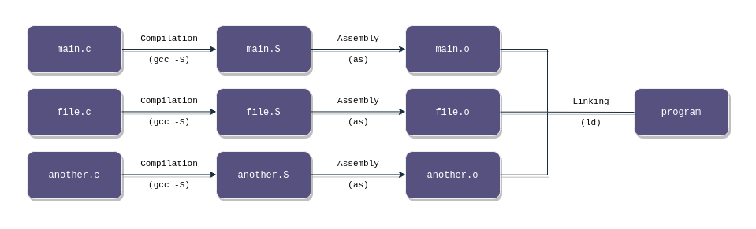

O primeiro passo é a compilação de um ou mais arquivos de código-fonte de uma linguagem de programação de alto nível para um fonte em assembly, representado pelo passo *Compilation (gcc -S)* na figura. Tomemos como exemplo o seguinte código *hello.c*:

```c
#include <stdio.h>

int main(void){
	printf("Hello World\n");
	return 0;
}
```

Ao executarmos `gcc -S hello.c`, obtemos a seguinte saída no arquivo gerado *hello.s*:

```asm
        .file   "hello.c"
        .text
        .section        .rodata
.LC0:
        .string "Hello World"
        .text
        .globl  main
        .type   main, @function
main:
.LFB0:
        .cfi_startproc
        endbr64
        pushq   %rbp
        .cfi_def_cfa_offset 16
        .cfi_offset 6, -16
        movq    %rsp, %rbp
        .cfi_def_cfa_register 6
        leaq    .LC0(%rip), %rax
        movq    %rax, %rdi
        call    puts@PLT
        movl    $0, %eax
        popq    %rbp
        .cfi_def_cfa 7, 8
        ret
        .cfi_endproc
.LFE0:
        .size   main, .-main
        .ident  "GCC: (Ubuntu 11.4.0-1ubuntu1~22.04) 11.4.0"
        .section        .note.GNU-stack,"",@progbits
        .section        .note.gnu.property,"a"
        .align 8
        .long   1f - 0f
        .long   4f - 1f
        .long   5
0:
        .string "GNU"
1:
        .align 8
        .long   0xc0000002
        .long   3f - 2f
2:
        .long   0x3
3:
        .align 8
4:
```

Esse arquivo não é trivial e utiliza muitas muitas diretivas do [GNU Assembler](https://ftp.gnu.org/old-gnu/Manuals/gas-2.9.1/html_node/as_3.html), que não são necessariamente instruções. A main é indicada pela label *main* e em específico pela label local *.LFB0*. A string *Hello, World* é indicada pela label local *.LC0*, que é utilizada diretamente em *.LFB0*.

O arquivo descrito acima é processado internamente pela suite *gcc* para gerar o *arquivo-objeto*, algo que também pode ser realizado pelo GNU Assembler via `as hello.s -o hello.o`, conforme imagem abaixo. Ao analisar os metadados de `hello.o` com os softwares *file* e *readelf*, é possível perceber que um arquivo-objeto em Linux nada mais é que um arquivo ELF relocável (mais especificamente o tipo **ET_REL** no campo *ElfN_Ehdr->e_type* de um arquivo ELF).

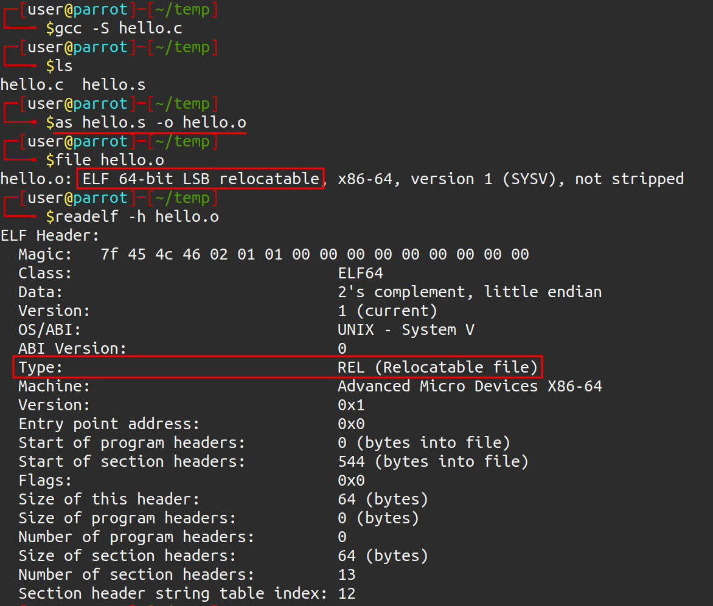

> **NOTA**: esse passo também pode ser realizado diretamente pelo utilitário gcc, através do comando `gcc -c hello.c -o hello.o`. Através desse comando não é necessário compilar e montar diretamente o arquivo-fonte.

Porém, se tentarmos executar o arquivo-objeto criado a partir da montagem, obtemos o seguinte erro:

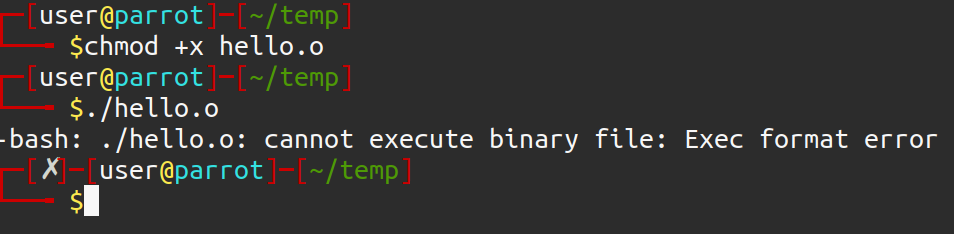

O leitor pode estar se perguntando: "mas o arquivo-objeto montado já contém dados e código, por que não é possível executá-lo?". Para explicar melhor essa questão, vamos relembrar a saída do comando *file*:

> hello.o: ELF 64-bit LSB relocatable, x86-64, version 1 (SYSV), not stripped

O atributo relocável traz o significado de "móvel". Um arquivo-objeto não está ligado a outros códigos-objeto e bibliotecas, eles se referem apenas àquela [unidade de tradução](https://en.wikipedia.org/wiki/Translation_unit_(programming)). Logo, ele não contém códigos externos àquela unidade de tradução (ou arquivo fonte + diretivas #include), não podendo rodar corretamente. Porém, isso permite que ele seja ligado a outros arquivos-objeto para montar um executável final - por isso o nome "relocável".

Entretanto, não é possível executar o arquivo-objeto até mesmo de um código mínimo que não possui ligações externas. O motivo é que um arquivo-objeto, devido a ser relocável, não contém endereçamento virtual definido. Podemos checar isso realizando o disassembly da função mais com um software disassembler, como o *objdump*:

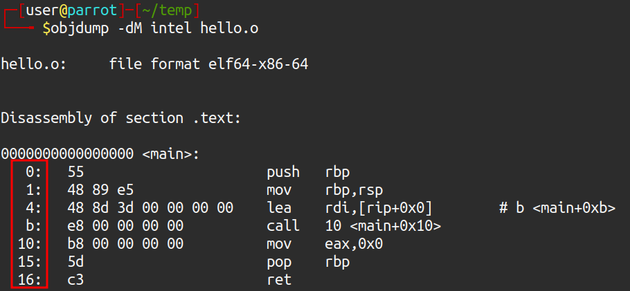

Note que os endereços das instruções, destacados em vermelho, estão iniciando em endereços muito baixos, partindo do 0, além das referências apontarem para endereços que não fazem sentido. Esses valores são como *placeholders* para serem definidos corretamente na última fase: o Linking.

A etapa de linking irá unir os arquivos-objetos em um único executável, definindo o endereçamento virtual de cada seção, suas permissões e resolvendo as referências de endereços nas instruções. Isso é feito pelo software *ld*, chamado implicitamente pelo gcc quando o argumento *-c* não é passado. Na imagem abaixo é possível verificar que o arquivo final realmente é executável e as referências de endereços foram devidamente resolvidas.

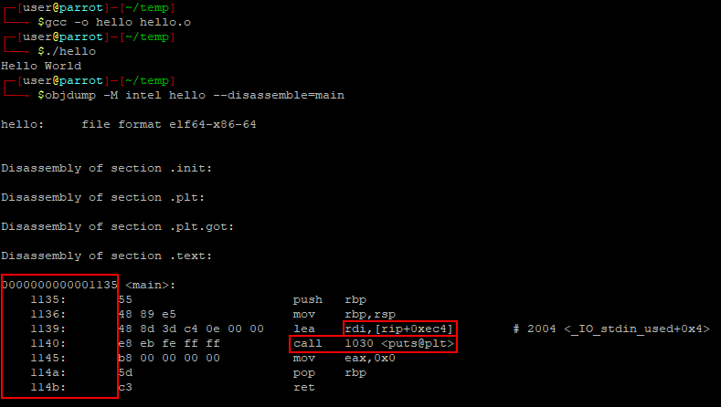

## Tipos de linking

Nas seções anteriores foi explicado o processo da geração de um executável. Entretanto, a fase de linking tem suas particularidades, em especial para a Segurança da Informação. Há três tipos de linking principais que mais encontramos nos programas para sistemas operacionais atuais: linking estático (*static linking*), linking dinâmico (*dynamic linking*) e linking em tempo de execução (*runtime linking*). Nas seções abaixo serão explanados os tipos de linking, suas características e como realizá-los em GNU/Linux e Windows.

Para todos os exemplos, a não ser que explicitamente falado, utilizaremos como base os seguintes arquivos-fonte:

**main.c**
```c
#include "mymath.h"
#include <stdio.h>

int main(void){
  int c = soma(1, 2);
  printf("A soma eh %d\n", c);
  return 0;
}
```

**mymath.c**
```c
#include "mymath.h"

int soma(int a, int b){
  return a + b;
}
```

**mymath.h**
```c
int soma(int a, int b);
```

O objetivo é compilar essa solução com os diversos tipos de linking, que resultará em um executável (*main.c*) que chama o código disponível em *mymath.c*. *mymath.c* será a biblioteca utilizada para demonstrar os tipos de linking. Especificamente, será realizada uma chamada à função *soma(int, int)* que irá retornar a soma de dois inteiros.

### Static Linking
O linking estático ocorre quando o código de uma biblioteca tem suas funções e dados "copiados" para o executável final. A biblioteca é chamada de biblioteca estática (extensão *.a* em GNU/Linux e *.lib* em Windows) e ela será composta de uma série de arquivos-objeto que a implementam. De fato, em especial no Linux, a biblioteca é apenas um *archive*, ou um arquivo composto de diversos outros arquivos, criado pelo software *ar*.

Nesse tipo de linking, não há dependências de runtime, pois o executável gerado já irá conter todo o código necessário para execução.

#### ELF

No diagrama abaixo estão representados os passos para a construção de um executável ELF usando *static linking*.

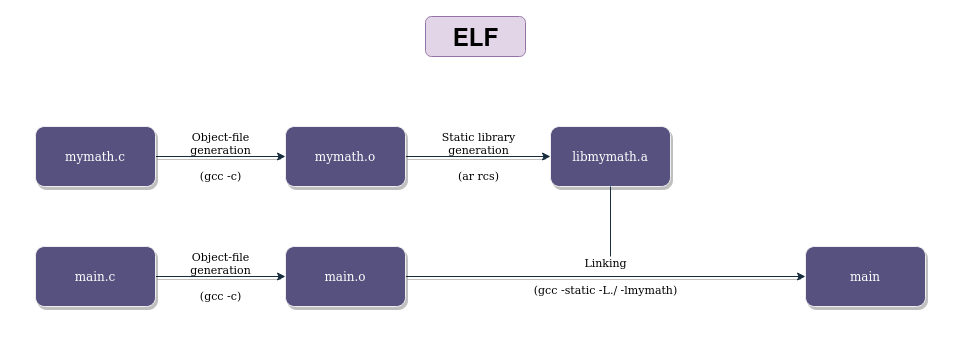

Primeiramente iremos gerar os arquivos-objeto dos dois arquivos principais, *main.c* e *mymath.c*:

> `gcc -c main.c mymath.c`

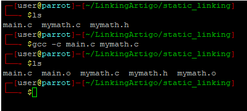

Agora, temos que criar a biblioteca estática via software *ar*, o archiver do projeto GNU. Lembrando que a biblioteca estática nada mais é que um *archive* contendo uma série de arquivos-objeto que a implementam. Para fins de compilação via gcc, é recomendável que a biblioteca criada tenha o nome de **libnomedabiblioteca.a**. No nosso caso, *libmymath.a*.

> `ar rcs libmymath.a mymath.o`

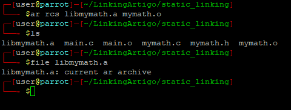

Após a geração da biblioteca, só precisamos linkar o objeto *main.o* com a biblioteca e gerar o executável final. O parâmetro *-L* do gcc especifica uma localização adicional na qual deve ser pesquisada as bibliotecas não encontradas em caminhos-padrão do sistema. Nesse caso, adicionamos a localização do diretório atualmente aberto. Por fim, o parâmetro *-l* especifica uma biblioteca a ser linkada, no formato *libmymath.a* (quando especificado apenas como *-lnomedabiblioteca*, o gcc irá procurar pela bibliteca *libnomedabiblioteca.a*).

> `gcc -o main main.o -L./ -lmymath` ou `gcc -o main main.o -L./ -l:libmymath.a`

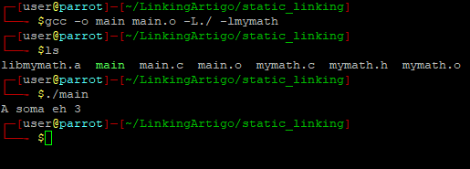

Podemos utilizar o software *ldd*, que checa por informações de bibliotecas dinâmicas em um binário e não encontramos o nome da libmymath:

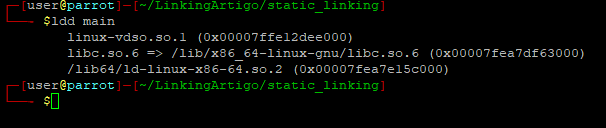

Isso demonstra que, pelo menos para essa biblioteca, o linking ocorrido foi do tipo estático. Há ainda bibliotecas dinâmicas pois utilizamos a biblioteca padrão *libc* para prover funções de I/O, com o *printf*. Em GNU/Linux é possível gerar um executável 100% linkado estaticamente devido ao número das syscalls não mudarem - toda função implementada em C passa necessariamente por uma ou mais syscalls. Dessa forma, a geração fica facilitada pois para o compilador é necessário apenas conhecer os números das syscalls e seus argumentos para gerar um binário estático.

Para gerar um binário 100% estático, basta adicionar *-static* na linha de geração do executável. Verificando com o *ldd*, é retornado que o binário não é dinâmico:

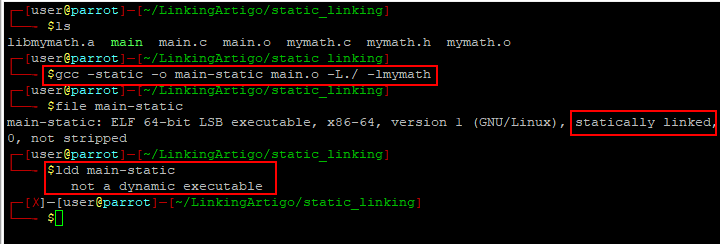

#### PE

No diagrama abaixo estão representados os passos para a construção de um executável PE usando *static linking*.

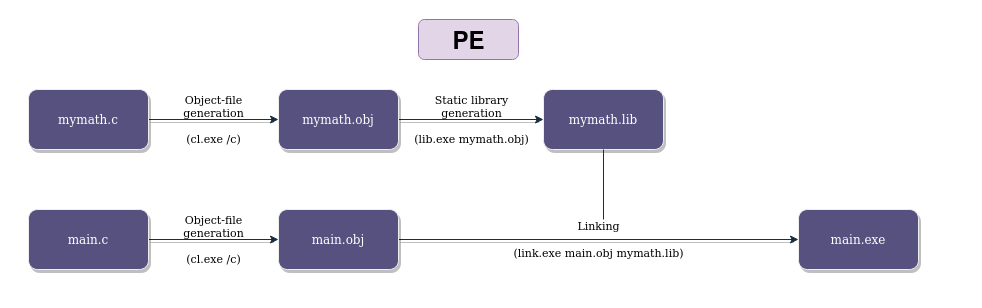

O processo é semelhante ao ELF, mas nesse caso utillizaremos o compilador de C/C++ da microsoft (*cl.exe*), disponível no [Visual Studio Community](https://visualstudio.microsoft.com/vs/community/), na opção de "Desenvolvimento para desktop com C++ " e acessível via "Developer Powershell for VS 2022"

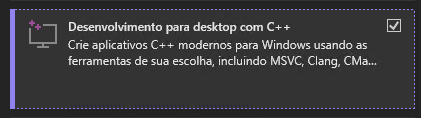

O passo-a-passo segue abaixo, com a compilação do *main.c* e *mymath.c* para arquivos-objeto (*.obj* no Windows):

> `cl.exe /c main.c mymath.c`

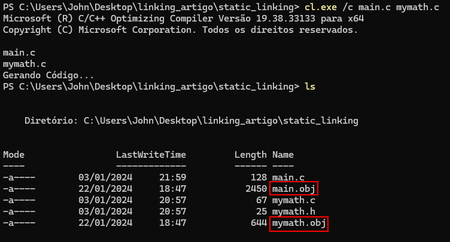

A geração da biblioteca estática é feita a partir da ferramenta *lib.exe*, indicando o arquivo-objeto criado. O nome da lib ficará como *mymath.lib*:

> `lib.exe .\mymath.obj`

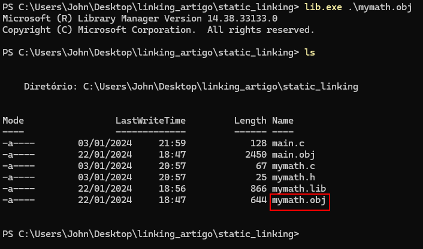

Por fim, chamaremos a ferramenta *link.exe*, o linker do Visual Studio, para gerar o executável final:

> `link.exe main.obj mymath.lib`


Verificando a Import Table do EXE com o software [Detect It Easy](https://github.com/horsicq/Detect-It-Easy), é possível perceber que não há dependências com relação ao código implementado.

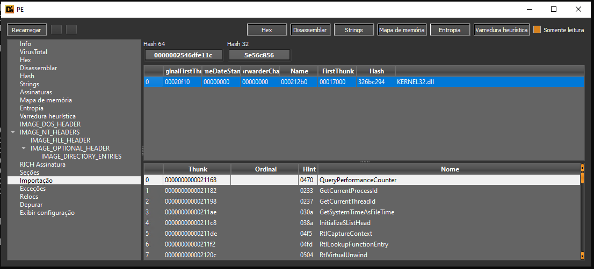

Note que há a dependência ainda da *KERNEL32.DLL*. Isso se deve ao fato de que no Windows as syscalls não são chamadas diretamente: os códigos deverão executar funções da *ntdll.dll* que irão chamar as syscalls. *Kernel32.dll* é uma biblioteca "mais alto nível" que a *ntdll.dll*, mais estável e documentada, e que chama a *ntdll.dll* para executar suas próprias funções.

Esse design dos componentes permite que o sistema operacional mude o número das syscalls sem impactar os softwares, e o número das syscalls pode mudar em uma atualização do Windows. Logo, o compilador não irá saber os números das syscalls a serem chamadas, necessitando chamar a *Kernel32.dll* (nesse caso) como API para suprir essa falta de número das syscalls. É por isso que comumente não encontramos binários estáticos para Windows, pois o número das syscalls pode mudar a qualquer momento, não sendo confiável para um compilador utilizá-las.

### Dynamic Linking (load-time Dynamic Linking)

O linking estático permite rodar um código sem dependências, porém seu uso traz algumas desvantagens:

- O executável final irá conter o código da biblioteca, acarretando em um tamanho maior do código;
- Quando houver uma atualização na biblioteca, será necessário recompilar também o código do executável final.

A solução para esses problemas é adicionar uma dependência de runtime, uma biblioteca dinâmica. Seu código não irá compor o executável final, mas irá ter uma referência nas *Import Tables* dos arquivos PE (e sua contraparte ELF, a seção *.dynsym*).

A fase de linking também será diferente, pois não haverá a cópia do código para o executável, mas irão ser criados JMPs para seções especiais, como a *.plt* e a Global Offset Table (GOT) nos executáveis ELF. Qualquer chamada a código externo irá resultar em um JMP para seção *.plt*, que irá chamar um stub de código especial que irá recuperar o endereço da função externa na GOT.

Para executar o código final será necessário que a biblioteca esteja em um local padrão procurado pelo sistema operacional, ou adicionado via variáveis de ambiente, como veremos nas próximas seções.

#### ELF

No diagrama abaixo estão representados os passos para a construção de um executável ELF usando *dynamic linking*.

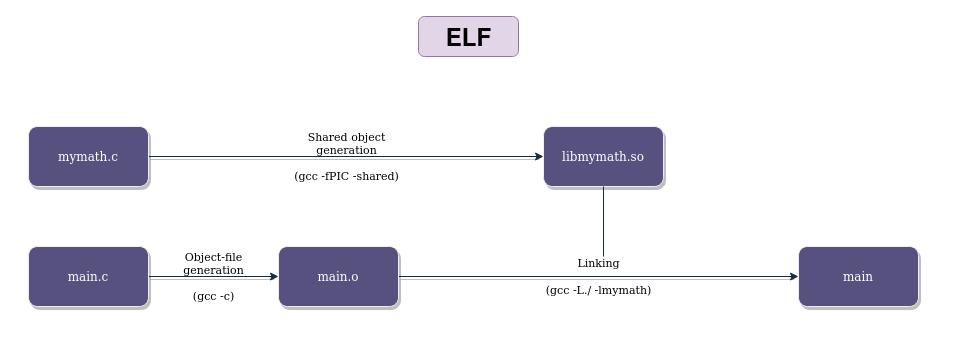

O passo-a-passo para compilar uma solução com *dynamic linking* está descrito abaixo:

1. compilação de *main.c* para arquivo objeto (`gcc -c main.c`);
2. compilação da *mymath.c* na biblioteca dinâmica *libmymath.so*. Esse processo necessita dos parâmetros *-fPIC* e *-shared* para permitir que o binário resultante tenha *Position Independent Code*, que permite um binário ser carregado em qualquer endereço na memória (e não só aquele definido no processo de compilação), e que esse binário é um objeto compartilhado (shared object);

Após esses dois passos, exemplificados na imagem abaixo, podemos checar com o comando *file* que realmente a biblioteca gerada é um *shared object*, e não mais um simples arquivo composto de arquivos-objeto.

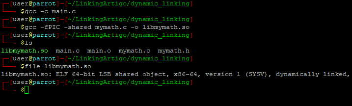


O executável deve ser criado utilizando a opção *-L*, especificando o diretório atual (*./*). Isso faz com que o linker procure por bibliotecas também no diretório especificado. Essa opção, em conjunto com *-lmymath*, faz com que o linker procure e encontre o arquivo *libmymath.so*, realizando o linking dinâmico. O linking dinâmico pode ser evidenciado a partir da ferramenta *ldd*, que lista as bibliotecas dinâmicas utilizadas por um binário não estático: 

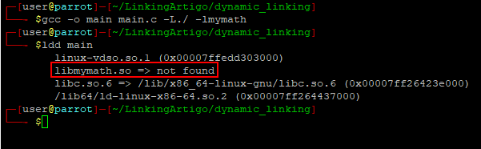


Note, porém, que o sotware não encontrou a biblioteca especificadada. A tentativa de execução pelo meio convencional também irá resultar em falha, conforme imagem abaixo. Isso se deve ao fato de que o loader procura por bibliotecas dinâmicas em locais padrão do sistema operacional.

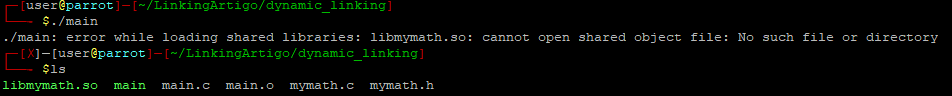

Para especificar um diretório não padrão, podemos utilizar a variável de ambiente *LD_LIBRARY_PATH*, passando um ponto para especificar o diretório padrão. Conforme imagem abaixo, é possível verificar que tanto o ldd quanto a execução do binário funcionam corretamente após a definição dessa variável: 

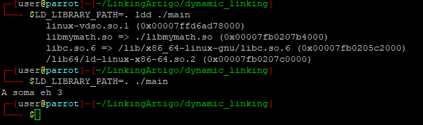

#### PE

No diagrama abaixo estão representados os passos para a construção de um executável PE usando *dynamic linking*.

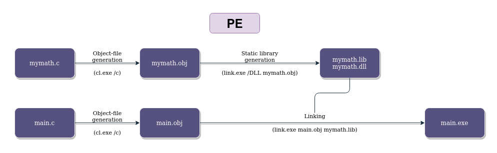

Para esse exemplo, utilizaremos o seguinte conteúdo para o arquivo *mymath.c*:

```c
#include "mymath.h"
#include <windows.h>

int __declspec(dllexport) soma(int a, int b){
	return a + b;
}
```

e para o arquivo *mymath.h*:
```c
int __declspec(dllexport) soma(int a, int b);
```

Isso é necessário para declarar a função *soma(int, int)* como um export da biblioteca dinâmica gerada, e, logo, acessível externamente.

O primeiro passo, como em outros anteriores, é a construção dos arquivos-objeto. Nesse caso, utilizaremos o *cl.exe /c main.c mymath.c* para gerá-los de uma só vez. Isso irá criar os arquivos de nome *main.obj* e *mymath.obj*:

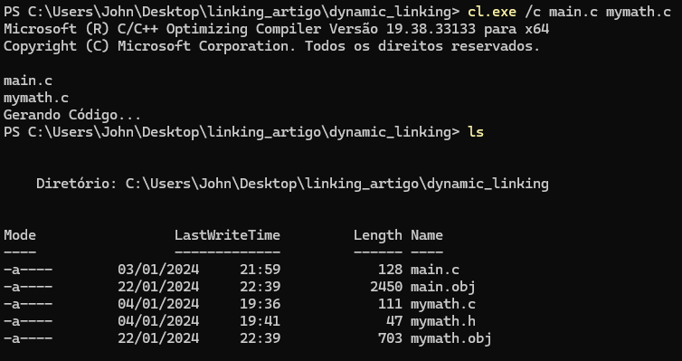

Para criar uma biblioteca dinâmica, ou DLL, no Windows, podemos utilizar a ferramenta *link.exe* com a linha de comando *link.exe /DLL mymath.obj*. Isso irá criar 3 arquivos: *mymath.dll*, *mymath.lib* e *mymath.exp*. Para nosso artigo, iremos focar em *mymath.dll* e *mymath.lib*.

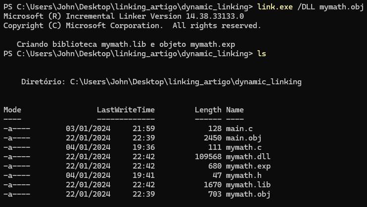

O linking dinâmico no Windows é um pouco diferente da sua contraparte Linux. Iremos utilizar a ferramenta *link.exe* para linkar o *main.obj* com a *mymath.lib*, através da linha de comando *link.exe main.obj mymath.lib*. Isso pode soar como um linking estático, mas não é! Esse arquivo *.lib* irá conter as informações necessárias para se linkar um código dinamicamente com *mymath.dll*, e esta, por sua vez, irá compor a dependência em runtime do binário. Em resumo: para compilar, devemos utilizar a *mymath.lib* e para rodar precisaremos da *mymath.dll* em um dos [diretórios padrão para busca de DLLs](https://learn.microsoft.com/en-us/windows/win32/dlls/dynamic-link-library-search-order).

Como a DLL Search Order tem como um dos seus diretórios de busca o diretório corrente ou do binário, a execução não necessitará de nada além da *mymath.dll* para funcionar:

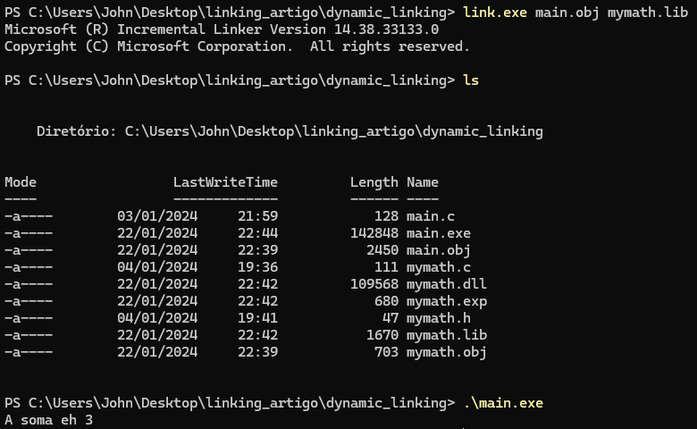

Utilizando o sotware Detect It Easy, é possível verificar que há uma entrada na Import Table do executável que representa a função externa utilizada e a DLL. Isso caracteriza o linking dinâmico.

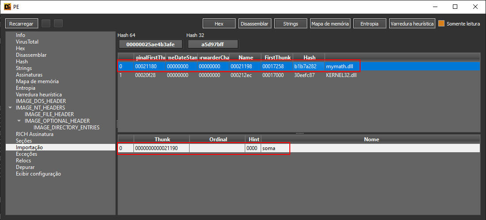


### Runtime Linking (run-time Dynamic Linking)

O runtime dynamic linking envolve o uso de uma biblioteca dinâmica mas não gera uma entrada na *Import Table* ou *.dynsym*. Isso é possível pois a biblioteca dinâmica, diferentemente do dynamic linking tradicional, é linkada em tempo de runtime e não de compilação. São utilizadas funções especiais para recuperar os endereços das subrotinas requeridas e ponteiros para funções são instanciados para executá-las. Como a forma de obter essas informações em runtime dependem do formato de arquivo e até de componentes do sistema operacional, geralmente são escritos códigos diferentes para sistemas operacionais diferentes.

#### ELF

No diagrama abaixo estão representados os passos para a construção de um executável ELF usando *runtime linking*.

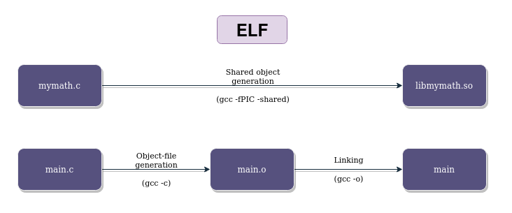

Abaixo está o código *main.c* utilizado para o runtime linking.

```c
#define _GNU_SOURCE
#include <dlfcn.h>
#include <stdio.h>

typedef int (*soma_func)(int, int);

int main(void){
  void * mymath_handle = dlopen("libmymath.so", RTLD_LAZY | RTLD_GLOBAL);
  if(mymath_handle == NULL){
    printf("ERROR: dlopen!\n");
    return 1;
  }

  printf("libmymath.so loaded!\n");
  soma_func sum = (soma_func) dlsym(mymath_handle, "soma");

  if(sum == NULL){
    printf("ERROR: dlsym!\n");
    return 1;
  }

  printf("soma() found!\n");

  int value = sum(1, 2);
  printf("The sum is: %d\n", value);

  if(dlclose(mymath_handle)){
    printf("ERROR: dlclose!\n");
    return 1;
  }

  printf("libmymath.so handle closed!\n");

  return 0;
}

```

Podemos copiar a *libmath.so* gerada no dynamic linking para o diretório de exemplo do runtime linking para não termos que recompilá-la. Para compilar o novo arquivo *main.c*, devemos passar para o gcc a biblioteca de linking dinâmico, que contém as funções necessárias para realizar a pesquisa e recuperação dos endereços dos símbolos disponíveis na biblioteca de exemplo.

> `gcc -o main main.c -ldl`

Conforme exemplificado na imagem a seguir, o binário foi gerado com sucesso mas sua execução por si só resulta em erro. Esse é o mesmo caso que explicamos no dynamic linking, resolvido com o uso da variável de ambiente *LD_LIBRARY_PATH*.

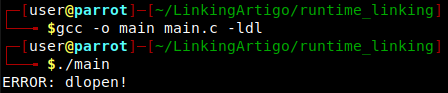

Seguindo o fluxo de código, o código da biblioteca *libmymath.so* é carregado através das funções *dlopen* e *dlsym*, para encontrar em memória o endereço da função *soma(int, int)*. Quando encontrado, é instanciado um ponteiro para a função que logo após é chamado, retornando o valor 3. Por fim, a biblioteca é fechada e o código termina.

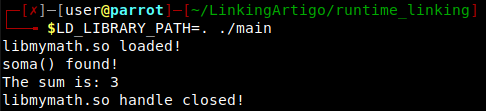

Logo, esse binário necessita que *libmymath.so* exista para que sua execução tenha sucesso. Porém, se checarmos a saída do software *ldd* para esse binário, verificaremos que não há nenhuma entrada para o arquivo *libmymath.so*. Isso caracteriza runtime linking.

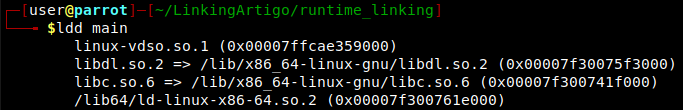

#### PE

No diagrama abaixo estão representados os passos para a construção de um executável PE usando *runtime linking*.

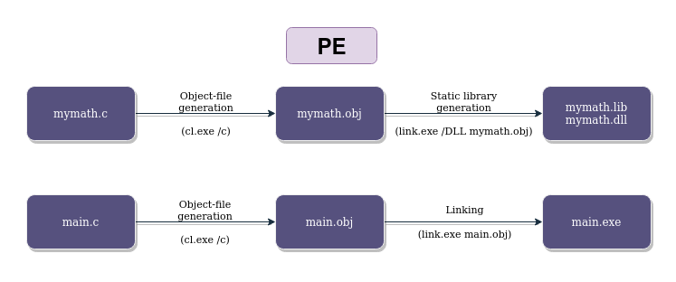

Neste exemplo, iremos utilizar o seguinte conteúdo no arquivo *main.c*:

```c
#include <stdio.h>
#include <Windows.h>

typedef int (*func)(int, int);

int main(void){
    HMODULE mymathDll = LoadLibraryA("mymath.dll");
    if(!mymathDll){
        printf("ERROR: %d\n", GetLastError());
        return 1;
    }
    func somaPtr = (func) GetProcAddress(mymathDll, "soma");
    if(!somaPtr){
        printf("ERROR: %d\n", GetLastError());
        return 1;
    }

    printf("A soma eh %d\n", somaPtr(1, 2));
    
}
```

No caso de um EXE, para realizar runtime linking é necessário o uso de APIs como *LoadLibrary/GetProcAddress/GetModuleHandle* para carregar uma DLL em um ponto do código e encontrar a função que se deseja executar.

Para esse exemplo, podemos copiar a DLL *mymath.dll* já compilada na seção de dynamic linking para o diretório que *main.c* está. Iremos gerar o executável *main.exe* através da execução da linha de comando *cl.exe main.c*. Sua execução, caso mymath.dll esteja no mesmo diretório, não resulta em nenhum problema.

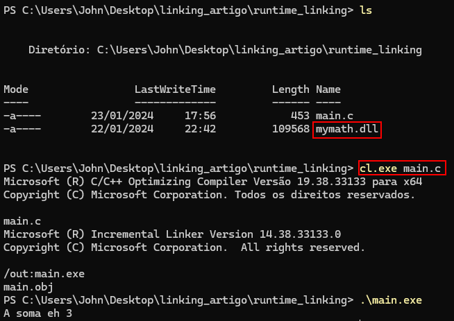

Na ferramenta DIE é possível verificar que não há entradas para a mymath.dll, caracterizando runtime linking.

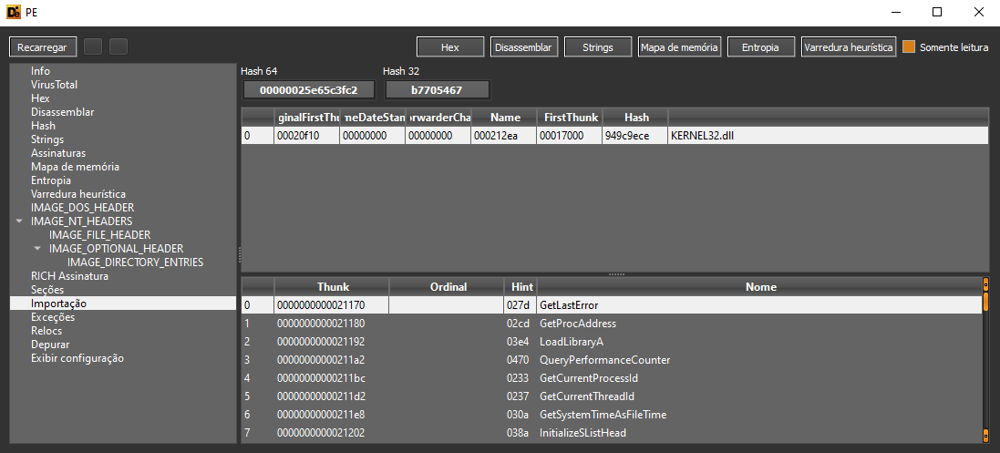

# Conclusão

Nesse artigo foram abordados os tipos de linking existentes nos principais sistemas operacionais e formatos. No próximo artigo dessa série iremos explorar as possibilidades de transformar esses tipos de linking em capacidades maliciosas (em especial, o runtime linking!).
