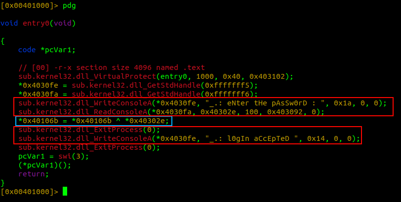

# Introdução

Nesse artigo, iremos resolver o desafio [crackme#7](https://crackmes.one/crackme/64764cee33c5d439389134f2) do usuário [timotei_](https://crackmes.one/user/timotei_), disponibilizado na plataforma crackmes.one. Trataremos nas seções que seguem das análises estática e dinâmica de um código que modifica sua própria estrutura dependendo de certas condições.

# Triagem inicial

O binário trata-se de um *EXE (32-bit)* escrito em *Assembly x86*, montado pelo software assembler *MASM*. Há apenas três seções, sendo duas de dados e uma de código, e todas têm entropia baixa, indicando que não há dados comprimidos/ofuscados. Isso significa que podemos ir direto para o código, sem necessidade de analisar e executar stubs.

*Figura 1: indicação do montador e tipo de arquivo.*

*Figura 2: entropia das seções, obtidas com o software radare2.*

Analisando o código estaticamente é possível verificar que não há funções implementadas, apenas o entrypoint e cinco funções importadas da `kernel32.dll`. Também há duas strings que remetem às funcionalidades de leitura de senha e realização de login.

*Figura 3: listagem do entry point (entry0), funções importadas e strings.*

# Execução

Quando executado, um prompt pedindo uma senha é mostrado na tela, juntamente com a mensagem `_.: eNter tHe pAsSw0rD : `.

*Figura 4: prompt de senha.*

Ao digitar qualquer senha, há dois comportamentos possíveis:

1. o programa fecha normalmente, sem erros;

*Figura 5: programa fechando normalmente.*

2. o programa irá *crashar*.

*Figura 6: programa crashando.*

Esse comportamento de crash acontece independente do tamanho da senha digitada, que difere de um *buffer overflow* comum. Exemplos de casos são os caracteres *a*, que encerra o processo graciosamente, e *b*, que resulta em um encerramento abrupto. Isso pode ser um indício de que o programa provavelmente está utilizando o input para realizar alguma operação em cima da seção de texto (como, por exemplo, executar dados como código).

*Figura 7: inputs 'a' e 'b' e seus respectivos códigos de retorno.*

Como sabemos, a baixo nível códigos e dados são apenas bytes, logo esse tipo de comportamento é possível no nível de código de máquina (e é assim que *buffer overflows* ocorrem!).

Entretanto, há um problema. Compiladores por padrão geram executáveis com seções de código com proteções especiais. No nosso caso, conforme a *Figura 2*, a seção `.text` está com permissões RX, que significa na prática que não é possível escrever nela.

Mas nossa hipótese de uso de dados como código não está totalmente descartado. Vamos aprofundar a análise com uma análise estática.

# Análise estática de código

Utilizaremos o radare2 para analisar estaticamente o código. Para a análise estática de código, um engenheiro reverso pode utilizar-se de duas estratégias principais: o *disassembly* das instruções em mnemônicos e argumentos, ou a descompilação, que tenta traduzir as instruções de volta para uma linguagem de alto nível (geralmente C).

O radare2 conta com dois plugins extremamente úteis para o processo de descompilação. São eles: [r2dec](https://github.com/wargio/r2dec-js) e [a integração do descompilador do Ghidra](https://github.com/radareorg/r2ghidra). Vamos analisar o resultado dos dois descompiladores abaixo

## r2dec
Analisando o entrypoint, é possível perceber três blocos principais:
1. o primeiro, em vermelho, que escreve a string `_.: eNter tHe pAsSw0rD : ` na tela e lê *0x64=100* bytes para o endereço `0x40302e` - [documentação da função *ReadConsoleA*](https://learn.microsoft.com/en-us/windows/console/readconsole) informa esses campos;
2. um segundo bloco, em ciano, que faz operações matemáticas utilizando o registrador *EAX*, que recebe um ponteiro para os 4 bytes de `0x40302e` - a senha digitada, além de outras operações aritméticas sem sentido;
3. um terceiro bloco, em vermelho, que demonstra que as instruções que desejamos executar para concluir o desafio estão após uma chamada do *ExitProcess*.

*Figura 8: descompilação com r2dec.*

Precisamos de uma forma de "pular" essa chamada a fim de evitar o término do processo. Apenas com as informações dessa descompilação, não é claro qual a forma de burlar essa execução.

## r2ghidra

A saída do descompilador do Ghidra é mais limpo, com os mesmos blocos destacados na *Figura 9*, mas ainda assim não deixa claro qual o meio de pular a chamada do *ExitProcess*.

*Figura 9: descompilação com r2ghidra*

Após verificar dois descompiladores, talvez o disassembly nos auxilie.

## Disassembly

Os mesmos blocos explicados na seção do r2dec estão na *Figura 10*. A vantagem de analisar com um disassembler poderoso como o disponível no framework radare2 é que é possível trabalhar com endereços (primeira coluna), *opcodes* - ou bytes das instruções (segunda coluna) e com os mnemônicos e argumentos das instruções (terceira coluna).

*Figura 10: disassembly do entrypoint do binário.*

Analisando atentamente as duas instruções após a chamada de *ReadConsoleA*, é possível identificar a passagem de 4 bytes do endereço `0x40302e` (senha digitada) para o registrador EAX e após isso há uma operação XOR de 4 bytes de *EAX* com o valor apontado por `0x40106b`, **que aponta para a instrução após o XOR**.

*Figura 11: operação XOR de EAX com bytes apontados por um endereço da `.text`*

Além disso, tanto nas saídas dos descompiladores quanto no disassembly, a primeira função chamada é a [*VirtualProtect*](https://learn.microsoft.com/en-us/windows/win32/api/memoryapi/nf-memoryapi-virtualprotect). Essa chamada com os argumentos repassados via *calling convention* torna *0x3e8=1000* bytes a partir do entrypoint executáveis, a partir da configuração do valor 0x40 (PAGE_EXECUTE_READWRITE) na execução do *VirtualProtect*. Com isso, é possível alterar 1000 bytes da seção `.text`, que por padrão não permite. Matamos a charada!

Tendo isso em mente, o que precisamos para resolver o desafio é um valor digitado que XOR com os 4 bytes a partir de `0x40106b` resulte em um pulo para o endereço da primeira instrução após o *ExitProcess*, que é `0x0040107c`.

*Figura 12: pulo para a resolução do desafio.*

# Resolução

A primeira coisa que vem à mente é utilizar um [jump short, relativo](https://c9x.me/x86/html/file_module_x86_id_147.html) para alterar as instruções e efetuar o pulo para `0x0040107c`. Um JMP desse tipo utiliza apenas 2 bytes, um deles sendo o opcode EB e o outro sendo a quantidade de bytes entre a instrução do jump e o endereço para o qual se deseja mudar o fluxo de execução.

Logo, esses dois primeiros bytes que sofrerão a operação XOR para se transformar no JMP não deverão entrar na conta da diferença relativa. Contando a quantidade de bytes que há após esses dois bytes até a chamada de *ExitProcess* (incluído), temos 15 bytes.

*Figura 13: bytes a serem modificados em ciano, bytes até a chamada da resolução do desafio em vermelho.*

> Uma outra forma de contabilizar a quantidade de bytes seria subtrair os endereços: `0x0040107c - 0x0040106d = 15`

Agora sabemos que os 2 bytes a sofrerem o XOR devem se transformar nos bytes `EB 0F`. Trivialmente, aplicando uma operação de XOR em cada byte, obtemos a string `tI`, que é senha do desafio, conforme *Figura 14* e *Figura 15*.

*Figura 14: senha do desafio.*

*Figura 15: prova da corretude da senha.*

Na análise dinâmica, podemos verificar claramente o que acontece durante a execução:
- após digitar `tI` como senha, mas não aplicar o XOR, ainda se mantém o código original:

*Figura 16: execução passando *tI* como senha, antes da operação XOR.*

- após o XOR, o código se altera e o fluxo de código também se altera.

*Figura 17: execução passando *tI* como senha, após a operação XOR.*

# Conclusão

Nesse desafio foi possível perceber a capacidade de softwares para escreverem e executarem dados em regiões que a princípio seriam isentas de tais anomalias. Além disso, aprendemos um pouco mais sobre instruções e que apenas a descompilação pode não mostrar o resultado esperado, logo um engenheiro reverso tem que conhecer também assembly e ler tais códigos.