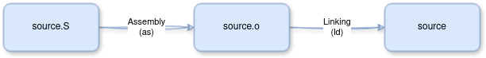

# Introdução

Esse artigo tratará dos primeiros passos para realizar engenharia reversa em softwares escritos para a arquitetura ARMv8 (64-bits). Para esse objetivo, primeiramente precisamos entender o que é ARM, suas características principais, como executar, entre outros conceitos básicos.
Após isso, serão descritos passos para a configuração de um ambiente próprio para executar instruções e programas produzidos para a plataforma Linux/ARM64. 

# O que é ARM? Por que estudar essa arquitetura em específico?

ARM, um acrônimo para *Advanced RISC Machine*, é uma arquitetura de computadores bastante utilizada em dispositivos móveis, IoT (incluíndo roteadores e dispositivos inteligentes), placas Raspberry Pi e até laptops, como os novos Macbooks. Versões de 32-bits da arquitetura geralmente são chamados de ARMv7 ou apenas ARM, enquanto que as versões de 64-bits são chamados de ARMv8, A64, ARM64 ou AARCH64. Nesse artigo, ARM será tratado como AARCH64, a não ser quando explicitamente avisado.

Ser RISC (*Reduced Instruction Set Computer*) significa ter um conjunto de instruções reduzido, mais simples em comparação com arquiteturas CISC (*Complex Instruction Set Computer*), como x86 ou amd64. Entretanto, essa "desvantagem" permite que a arquitetura necessite de menos energia para funcionar, permitindo seu uso em dispositivos embarcados e de limitação de processamento.

Abaixo estão algumas informações importantes sobre a arquitetura:

- Contém 31 registradores de propósito geral, de 64-bits, referidos como de x0...x30 (ou r0...r30)
- São acessíveis em suas versões 32-bits via notação w0...w30
- As instruções geralmente utilizam a notação `mnemônico DEST, SOURCE` ou `mnemônico DEST, SRC1, SRC2`
- As instruções têm tamanho fixo, de 4 bytes
- **Diferentemente da x86/amd64**, é baseada em [load/store](https://en.wikipedia.org/wiki/Load%E2%80%93store_architecture), ou seja, há uma divisão das instruções em instruções que fazem acesso à memória e as que realizam operações da ALU. Na prática, isso significa que não é possível realizar um ADD, SUB ou quaisquer outras operações utilizando operandos da memória, necessitando de instruções load para carregar antes os valores da memória em um registrador e após um store para armazenar o resultado na memória.

Na imagem abaixo, extraída de [Getting Started with Arm Assembly Language](https://developer.arm.com/documentation/107829/0200?lang=en), estão descritos alguns dos usos principais dos registradores de propósito geral.


Especialmente para o profissional da área de análise de malware, o estudo e o domínio de conhecimento da ARM, tanto em 32-bits quanto 64-bits, é algo necessário. Um grande número de smartphones rodam na plataforma Android ou iOS sobre ARM, e a cada dia mais novos malwares são disponibilizados (inclusive nas lojas oficiais!) para download. A análise de tais artefatos pode necessitar, além da análise do código-fonte, uma análise mais profunda a nível de código de máquina, exigindo do analista um conhecimento sobre a arquitetura.

Tal necessidade de aprendizado também é necessário para um pesquisador de vulnerabilidades. Em um mundo conectado via roteadores e dispositivos embarcados/IoT, esses proveem uma ampla gama de máquinas que podem conter sérias vulnerabilidades, como *Denial of Service* (DoS) e até *Remote Code Execution* (RCE).

Para rodar instruções ARM no contexto do uso de um sistema operacional, é necessário criar um programa em um formato específico que o *loader*, um software especial que permite criar processos, consiga entender - ou seja, um executável. Para isso, é necessário seguir os passos:

1. criação do programa principal em assembly (source.S);
2. utilização de um software assembler (as) para gerar o arquivo-objeto (source.o);
3. utilização de um software linker (ld) para gerar o executável final (source).

Na imagem abaixo está representado esse procedimento:



Na próxima seção será abordado a forma de executar código ARM em diversos contextos.


# Formas de rodar ARM

Há diversas formas de rodar instruções ARM, inclusive via web, como o site *CPUlator* [ (apenas 32-bits)](https://cpulator.01xz.net/?sys=arm). Aqui serão apresentadas duas formas: para quem já tem uma máquina AARCH64 e para quem não possui.

Em todos os casos os seguintes pacotes deverão constar no sistema:

- binutils é o pacote que conterá o GNU Assembler (as) e o linker (ld);
- vim é um editor de texto que será utilizado para escrever o código-fonte. Porém, a escolha de qualquer outro editor é possível e fica a cargo do leitor.

## Em uma máquina AARCH64

Se o leitor já possui uma máquina AARCH64, como um Raspberry Pi (versões mais recentes, como o 4) ou Macbooks mais recentes, não são necessárias ações adicionais de emulação do sistema. Apenas é recomendado a instalação de uma máquina virtual Linux, caso seu host não seja uma distro GNU/Linux, para prosseguir com a instalação dos seguintes pacotes:

```sh
sudo apt update -y
sudo apt install vim binutils
```

> No caso do Raspberry Pi OS, não é necessário instalar uma máquina virtual, apenas rodar os comandos acima.


## Em máquinas não compatíveis

Para máquinas Desktop atuais, com sistemas x86/amd64, o procedimento fica um pouco mais complicado, visto que esses computadores não entendem as instruções ARM nativamente. Nesse caso, o usuário têm duas opções a princípio: emular a plataforma ou criar uma instância na nuvem.

Abaixo estão os procedimentos para cada uma dessas abordagens.

### Emulação de AARCH64 via QEMU

Nesse caso, será necessário o uso de um emulador, como o [QEMU](https://www.qemu.org/) e uma imagem Linux, como o [Raspberry Pi OS](https://www.raspberrypi.com/software/operating-systems/). Essa imagem já vêm preinstalada, mas é necessário fazer algumas alterações para acesso à rede e ao SD Card virtual. É possível seguir o tutorial disponível no blog [Interrupt](https://interrupt.memfault.com/blog/emulating-raspberry-pi-in-qemu).

Para facilitar essa configuração (bem técnica e complicada), utilizaremos a imagem Docker citada no artigo. Para isso, seu sistema deve ter o Docker instalado, [clique aqui para ver o tutorial oficial de instalação no Ubuntu](https://docs.docker.com/engine/install/ubuntu/). Em seguida, realize um pull na imagem e crie o container com os seguintes comandos:

```sh
sudo docker pull docker pull stawiski/qemu-raspberrypi-3b:2023-05-03-raspios-bullseye-arm64
sudo docker run -it --rm -p 2222:2222 stawiski/qemu-raspberrypi-3b:2023-05-03-raspios-bullseye-arm64
```

O output esperado é semelhante ao das imagens abaixo:


Após o sistema carregar completamente, em outro terminal no seu host realize o login em *localhost:2222* via SSH, conforme imagem abaixo. O usuário é `pi` e a senha é `raspberry`:

```sh
ssh -p 2222 pi@localhost
```


Essa imagem já contém os utilitários do *binutils* instalados, não necessitando de pós instalação. Caso o leitor queira instalar um editor de texto, como o vim, deve seguir os seguintes passos:

```sh
sudo apt update -y
sudo apt install vim
```

### AWS

Essa abordagem não irá gerar lentidão de processamento, mas necessita de investimento monetário. É possível subir uma máquina Linux/AARCH64 em alguns cliques na AWS.

Para isso, realize login na AWS e acesse a [EC2 Dashboard](https://us-east-1.console.aws.amazon.com/ec2/home?region=us-east-1#Home:) e clique em "Launch Instance":


Dê um nome para a máquina, como "ubuntu-arm64", selecione a AMI "Ubuntu" e selecione a arquitetura "64-bit (ARM)":


No campo "Instance Type", selecione o tamanho requerido pela aplicação que deseja rodar e que caiba no seu investimento. No caso desse artigo, o tipo de menor preço (t4g.nano) já é suficiente.
Adicione também uma chave de acesso - ela será utilizada para realizar login via SSH na máquina criada.


Adicione um storage de pelo menos 8GB para abrigar o sistema operacional e os dados.


Ao fim, clique em "Launch instance" e aguarde a inicialização total da máquina.


Clique no ID da instância apresentado na tela e copie o endereço IPv4 público:


Após isso, é possível logar na máquina usando a chave *.pem* baixada, mas antes é necessário utilizar o comando `chmod 700 <chave>.pem` para diminuir suas permissões e permitir que o SSH realize a conexão com sucesso via `ssh ubuntu@<IPv4 público> -i <chave>.pem`:


Por fim, realize a instalação do binutils e um editor de texto com o comando:

```sh
sudo apt update -y
sudo apt install vim binutils
```

# Conclusão

Nesse artigo foram explicados conceitos básicos da arquitetura ARM os passos para a criação de um ambiente mínimo para a execução de instruções em máquinas nativas e em máquinas não compatíveis. No próximo artigo será mostrado a construção de um primeiro programa, um "Hello World" em ARM64.