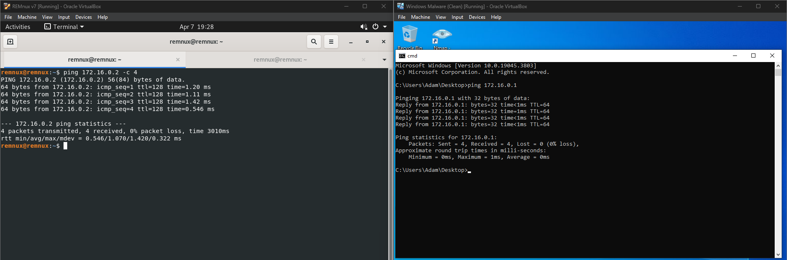

> Escrito por: Mateus Gualberto (Midnight Reverser)
> Licença: livre, como todo conhecimento deve ser.

# Introdução

Nesse artigo será apresentada uma abordagem para criação de um laboratório seguro local para análise de artefatos suspeitos ou maliciosos. É recomendado que o leitor siga o passo-a-passo na seção [Passo-a-passo](#passo-a-passo) à risca, para evitar qualquer problema de configuração 

Para seguir a parte prática desse artigo, é recomendado um computador de 64-bits Intel/AMD (arquitetura `amd64/x86-64`, não funcionará bem nos hardwares ARM, como MacBooks M1), com pelo menos 8GB de RAM, e um software Hypervisor - recomendamos o [Oracle VirtualBox](https://www.virtualbox.org/wiki/Downloads). A virtualização deve estar disponível e obrigatoriamente ativa no computador que hospedará o laboratório.

O laboratório construído nesse artigo é o alicerce para futuros artigos que tratarão da análise de malwares reais, em especial para análise dinâmica de malwares Windows.


# Laboratório para análise de malwares

Primeiramente, o leitor deve estar se perguntando, mas o que seria um laboratório para análise de malwares e por que eu devo ter um?

Um laboratório para análise de malwares é um ambiente isolado, reiniciável e sem ligação com dados sensíveis ou importantes do analista/organização (OPSEC), em que arquivos e comandos podem ser analisados estática e dinamicamente de forma segura - sem afetar sua identidade nem comprometer os dados ou ativos da sua organização.

Esse ambiente deve ser construído por qualquer profissional de segurança da informação ou pesquisador que tenha que lidar no cotidiano com arquivos suspeitos. Utilizá-lo trará mais segurança e confiabilidade ao trabalho desempenhado.

**Não necessariamente o próprio laboratório é um ambiente seguro!** A interação com ele sim deve ser segura, mas ele por si só tem fraquezas - como softwares vulneráveis rodando; não há nenhum software antivírus, firewalls e configurações de segurança - como o *User Account Control* (UAC) nele. Qualquer arquivo "esquecido" ou encontrado após um estado não confiável - como após executar algum código - deve ser tratado com extrema cautela. Em resumo, trate o ambiente como sempre infectado.

Há duas abordagens principais para construção de laboratórios seguros:

## Abordagem 0x00 - Laboratório físico

Nesse cenário, é necessário pelo menos uma máquina física que irá executar os softwares maliciosos. Ela não deve estar conectada à rede local padrão de uso cotidiano, podendo estar conectada apenas em uma rede isolada ou sem conexão alguma. É uma abordagem atípica e menos utilizada.


✅ Vantagens desse modelo:

- Malwares executarão em um computador real, logo qualquer medida anti-virtualização ou anti-sandbox presentes não serão executadas. Isso permite rodar o malware como ele foi projetado para infectar uma máquina;
- As máquinas utilizadas para análise podem ser mais fracas, caso sejam utilizadas para tarefas de análise menos intensivas e mais observacionais - como análise comportamental.

❌ Desvantagens:

- Necessário aquisição de máquinas reais, como notebooks ou PCs, que serão utilizadas apenas para a finalidade de análise;
- Há custos, também, com dispositivos de armazenamento externos, como SSDs, para restauração das imagens limpas após infecção;
- A restauração das imagens é um processo lento e que necessita de softwares especiais;
- É necessário acesso físico ao laboratório - exceto caso seja realizado uma configuração de VPN + Firewall rigorosos para liberação de acesso externo.
    - Entretanto, mesmo nesse caso, a restauração do sistema necessitaria de acesso físico ao laboratório.

## Abordagem 0x01 - Laboratório virtual

Nesse cenário, um laboratório mínimo pode ser criado através da instalação de uma máquina virtual Windows através de um Hypervisor (residente em um computador "host"), que contém todas as ferramentas, mas tem sua conexão de rede isolada ou desconectada totalmente. Essa configuração é a padrão utilizada por analistas de malware.

✅ Vantagens de se construir um laboratório virtual:

- Custo baixo para construção, caso já se tenha um notebook/computador mediano (8GB de RAM e um bom processador). Licenças do Windows podem não ser necessárias caso se trabalhe com VMs pré-licenciadas ou utilize o período de trial do Windows;
- Isolamento das máquinas do laboratório e construção de redes facilitado;
- Possibilidade de criação de snapshots - ou seja, capturas de um estado do Sistema Operacional, discos, configurações, etc;
- Possibilidade de migração do laboratório para outras máquinas, além da mobilidade caso o laboratório esteja em um notebook;
- Velocidade e facilidade em todos os sentidos: construção, restauração de estado limpo pós-infecção, dumps de memória;
- É possível criar uma configuração avançada mais facilmente com VPN + Firewall para acesso remoto seguro às VMs - ou até mesmo rodar o ambiente na nuvem. Com acesso também ao host por um meio remoto seguro é possível gerenciar os snapshots facilmente e restaurar o ambiente sempre que necessário.

❌ Desvantagens:

- Rotinas anti-virtualização e anti-sandbox serão um problema que deverá ser identificado e resolvido pelo analista de malware;
- Caso o computador host seja muito antigo, rodar uma ou mais VMs pode levar a lentidão generalizada e até mesmo impossibilidade de rodá-las.


A abordagem virtual é a que iremos seguir nesse artigo.

# Arquitetura do laboratório virtual

Com o objetivo de complementar as análises realizadas através da emulação de protocolos (para casos de análise de troca de informações com o C2, por exemplo), torna-se necessário adicionar uma máquina virtual a mais no laboratório, além da máquina Windows. Adicionaremos  uma máquina GNU/Linux, também isolada, mas inserida nesse ambiente e com conectividade para a máquina Windows.

> Por que não fazer a análise de pacotes de rede usando o próprio host vítima? Para uma boa parte dos casos, não há problemas em realizar a emulação no próprio host - e existem ferramentas para isso, como o [*Fiddler*](https://www.telerik.com/fiddler).
>
> Entretanto, caso o malware aplique técnicas que alterem como os pacotes são enviados através das APIs padrão (ou nem utilize-as), ferramentas de captura de pacotes podem não ser suficientes para identificar e decodificar esses pacotes. Além disso,  ferramentas para emulação de serviços e redirecionamento como o *fakenet*, *fakedns*, *inetsim* e muitas outras já têm versões para Linux facilmente instaláveis.

    


Nesse diagrama, temos a máquina Host, que executará um Hypervisor. Nesse hypervisor, teremos:

- Duas máquinas virtuais: uma Windows (Windows Malware), em que a maioria das análises serão realizadas, e uma Linux, em que serviços serão simulados e haverá a captura de pacotes de rede. A distribuição que utilizaremos para esse fim é a REMnux, distro que conta com dezenas de ferramentas de análise de malware;
- Uma rede interna (VirtualBox) ou Host Only **sem adaptador de rede no host** (VMware, não padrão, necessário criar essa rede no gerenciador de redes). Essa rede irá interligar o host Windows com o Linux, mas não permitirá tráfego para o Host, a rede doméstica em que ele está inserido e à Internet;

# Passo-a-passo

Nessa seção será mostrado um passo-a-passo para a construção e configuração do laboratório no VirtualBox. É necessário que o leitor tenha conhecimento prévio do processo de virtualização, do hypervisor utilizado - caso queira utilizar outro que não seja o VirtualBox - além do processo de instalação comum de um Sistema Operacional.

## Download REMnux

O REMnux pode ser obtido [por esse link](https://docs.remnux.org/install-distro/get-virtual-appliance). Faça o download da OVA do VirtualBox e tenha certeza que a extensão do arquivo é *.ova* antes de prosseguir para o próximo passo.


Após obter a OVA, acesse a opção `File > Import Appliance` no VirtualBox e selecione a OVA. Deixe as opções padrão em *Settings* durante a importação, ou, caso deseje, altere os valores de RAM e CPU. Conclua a importação e siga os próximos passos.


## Download Windows

Faça o download da ISO do Windows 10 através [desse link](https://www.microsoft.com/pt-br/software-download/windows10). A página irá redirecionar para o download de uma ISO caso seu Sistema Operacional seja diferente de Windows, e para o download de um software criador de ISOs Windows, caso contrário.


> Caso deseje, é possível utilizar Windows 11 - vantajoso devido a deprecação do Windows 10 ainda esse ano. Porém, como veremos à frente, a desativação do Windows Defender é mais complexa no Windows 11, por isso que foi decidido a instalação do Windows 10 nesse laboratório.

Crie a máquina Windows como o de costume: configure a RAM, processadores e disco, e pule a instalação desassistida. É recomendado pelo menos 4GB de RAM, 2 processadores e 70GB de disco.


Siga a instalação do Windows normalmente, porém não faça login com uma conta Microsoft; crie uma conta local.

## Instalação das ferramentas e configuração do ambiente

### Softwares utilizados

A maior parte das nossas ferramentas será instalada automaticamente através do [projeto retoolkit](https://github.com/mentebinaria/retoolkit). Faça o download da release mais recente e execute o EXE.

> É provável que o download seja marcado como não seguro devido à natureza das ferramentas contidas no pacote. Prossiga com a instalação normalmente.

A instalação padrão já é satisfatória para o laboratório. Caso queira mudar a localização padrão da instalação, recomendamos que seja colocado em `C:\retoolkit`, para facilitar a localização das ferramentas.


Além do retoolkit, faça o download dos seguintes softwares:

- Regshot (https://sourceforge.net/projects/regshot/)

Extraia apenas o *Regshot-x64-Unicode.exe*, os demais não são necessários.


- Sysinternals (https://download.sysinternals.com/files/SysinternalsSuite.zip)

Baixe e extraia os arquivos *Autoruns64.exe* e *Procmon64.exe*.


- Process Hacker System Informer (https://sourceforge.net/projects/systeminformer/files/systeminformer-3.2.25011-release-setup.exe/download)

Baixe e execute o instalador.

- Visual Studio Code (https://code.visualstudio.com/)

Baixe e execute o instalador. O Visual Studio Code ajudará na construção de scripts simples durante a extração de configuração de certos malwares, por exemplo.

Também é importante instalar pacotes de uma linguagem de programação, como o [Python](https://www.python.org/). Entretanto, sinta-se livre para instalar a(s) linguagem(ns) de programação que preferir.


### Configuração do explorer

Na configuração do explorer, na aba *View*, é interessante deixar todas as três checkboxes abaixo ativas, para mostrar as extensões dos arquivos e arquivos ocultos. Isso ajudará a identificar mais facilmente arquivos dropados.


### Desativação Windows Defender no Windows 10/11

A desativação do Windows Defender é essencial para a análise dos malwares. Não podemos deixar que um antivírus atrapalhe as análises, remova nossas ferramentas e scripts e faça ações automáticas, como bloqueio e envio de arquivos suspeitos para a Microsoft.

#### Windows 10 - Desativação via gpedit.msc

Essa técnica é a mais comum para Windows 10, mas nem sempre funciona - provavelmente devido a certas configurações gerados durante a instalação/builds específicas do SO.

Para usar essa técnica:

- Pesquise por *gpedit.msc* no Windows, ou use Win+R para executá-lo diretamente;
- Navegue em *Computer Configuration > Administrative Templates > Windows Components > Microsoft Defender Antivirus* e deixe selecionado "Microsoft Defender Antivirus" - não expanda-o;


- Clique duas vezes em "Turn off Microsoft Defender Antivirus" e deixe ativado;


- Após um reboot, verifique se as configurações de "Virus & threat protection" estejam desativadas, como na imagem abaixo.


Caso a desativação não funcione, é recomendável testar o método de [desativação no Windows 11](#windows-11-desativação-via-safe-boot). Ele deve funcionar corretamente.

#### Windows 11 - Desativação via safe boot 

Essa técnica foi compartilhada pelo OALabs no seu vídeo de criação de um ambiente de análise de malware em macs M1 (quem sabe, em breve, tenhamos um artigo sobre?). [Clique aqui](https://youtu.be/0eR8yrDLV5M?t=675&si=FKsJW2MuWuMRPaD6) para acessar o vídeo na minutagem em que começa a remoção do Windows Defender.

Em resumo: essa técnica consiste em mudar as permissões de `C:\ProgramData\Microsoft\Windows Defender` para que ninguém, nem mesmo Administrators ou SYSTEM tenha acesso ao diretório, evitando o funcionamento correto do Windows Defender.

Segue o passo-a-passo:

Execute *msconfig.exe* e vá na aba de Boot. Selecione *Safe boot* e clique em OK. Após isso, reinicie o computador.


Quando a máquina reiniciar, ela não terá carregado vários drivers e o leitor terá um privilégio alto nos diretórios sensíveis do Windows.


No explorer, vá até `C:\ProgramData\Microsoft\`, selecione o diretório `Windows Defender` e clique em propriedades.


Na aba Security, clique em *Advanced*:


Na janela que abrir, clique para mudar o Owner de *SYSTEM* para *Administrators* - irá abrir uma outra janela pedindo o nome do usuário/grupo que será o novo dono. Dessa forma, seu usuário terá acesso de mudar as demais configurações desse diretório.


Após isso, clique em *Replace all child object permission entries with inheritable permission entries from this object* e remova TODAS as permissions entries, inclusive dos Administrators. Isso resultará em erro de leitura/escrita pelo serviço do Windows Defender, impedindo seu funcionamento.


Por fim, execute o *msconfig.exe* novamente, removendo o *Safe Boot* e reiniciando a máquina.


Após reiniciar a máquina, verifique se o Windows Defender está ativo ainda, e caso esteja, siga para a próxima seção.

#### Windows 10/11 - Caso nenhuma outra técnica funcione...

Para essa técnica que desenvolvi, torna-se necessário executar o seguinte passo:

- Desative as seguintes opções no "Virus & threat protection" - em especial, a Tamper Protection;


Antes de analisar um malware, execute a seguinte linha em um PowerShell como administrador:

```powershell
while($true){Set-MpPreference -DisableRealtimeMonitoring $true; sleep 60}
```

Essa opção desativará o Windows Defender temporariamente, a cada 60 segundos, enquanto o processo do PowerShell que executar o comando continuar ativo. Ou seja, caso o processo seja encerrado por qualquer motivo, ou o computador reinicie, o Windows Defender será reativado automaticamente. Esse é o principal ponto negativo dessa técnica.

Também é possível adicionar todo o disco `C:\` na lista de diretórios a não serem varridos pelo Windows Defender - que é uma técnica efetiva para arquivos, mas certas funcionalidades antimalware, como o [AMSI](https://learn.microsoft.com/pt-br/windows/win32/amsi/antimalware-scan-interface-portal), continuarão ativas e detectando e bloqueando comandos maliciosos.

Uma última opção é procurar por scripts, como [esse](https://github.com/ionuttbara/windows-defender-remover), que se propõem a realizar a remoção forçada do Windows Defender. Para isso, é necessário pesquisar e estudar os efeitos colaterais dos scripts, bem como buscar uma versão atualizada - muitos deles não funcionam após algumas releases do Windows.

### Desativação do Firewall

O firewall padrão do Windows pode ser desativado facilmente através da pesquisa pela palavra *firewall* no menu pesquisar e clicar em *Firewall & network protection*.


Desative o firewall para todos os tipos de rede que estiverem presentes:


### Desativação do User Account Control

O UAC é uma medida que requisita autorização de um usuário Administrador para ações de alto privilégio no sistema - famoso por aquele prompt de sim/não quando um software quer executar algo como administrador.

Para isso, pesquise por "UAC" no menu pesquisar do Windows, selecione "User Account Control Settings" e coloque "Never notify". Confirme com OK.


### Desativação do Windows Update

Para evitar problemas como a restauração do Windows Defender, é interessante desativar o Windows Update. Isso também irá diminuir tentativas de conexão aos serviços Microsoft legítimos na captura de pacotes. Caso o leitor tenha obtido suas ferramentas via *retoolkit* via instalação padrão, o Windows Update já está desativado.

## Configuração da rede

**Muita atenção à essa parte!** A configuração correta da rede é fundamental para a segurança do host e da rede doméstica em que ele está inserido. Em resumo, iremos configurar uma rede interna, sem acesso algum à internet ou ao host. Isso significa que iremos mudar o adaptador de rede do hypervisor para uma rede interna (VirtualBox) ou hostonly **configurada sem adaptador para o host** (VMware).

Siga à risca os passos para as VMs explicitados nas seções que seguem para evitar problemas de segurança.

### Windows Malware

No VirtualBox, selecione a VM Windows, clique em Settings e navegue até a aba "Network":


Troque o tipo do adaptador 1 de "NAT" para "Internal Network", e coloque um nome como *malware_internal* na sua rede. Clique em OK.

> No VirtualBox, quando se nomeia uma rede, ela é criada automaticamente e fica disponível para configuração nas demais VMs.


Execute o painel de controle do Windows e navegue até *Network and Internet > Network and Sharing Center > Change adapter settings*. Clique com o botão direito no adaptador de Ethernet (deve ser o único que está conectado no ambiente) e clique em propriedades:


Pesquise por *Internet Protocol Version 4 (TCP/IPv4)* e clique em propriedades:


Coloque as exatas informações que estão na imagem abaixo na janela que abrir. Basicamente estamos definindo o IP do Windows como 172.16.0.2, e todo o tráfego deverá ir para o gateway 172.16.0.1 (REMnux, que iremos configurar abaixo). Clique nos dois OKs após configurar.


### REMnux

Na REMnux, altere as configurações do adaptador como feito na Windows. Nesse caso, a rede poderá ser selecionada sem a necessidade da digitação do nome dela novamente no campo *Name*.


> Caso o layout do seu teclado seja o padrão brasileiro (ABNT/ABNT2), execute o comando  `setxkbmap br` em um terminal para configurar temporariamente o REMnux para utilizar esse padrão.

Edite o arquivo */etc/netplan/01-netcfg.yaml* com um editor de texto (pode utilizar o *nano* ou o *vim*, por exemplo). O arquivo deve se parecer com esse abaixo. Lembre-se de editar com privilégios root!

> Por exemplo, `sudo nano /etc/netplan/01-netcfg.yaml`


O conteúdo deve ser exatamente o seguinte - com exceção do nome do adaptador, caso ele seja diferente do seu laboratório. Lembre-se de indentar corretamente com 2 espaços ou o YAML poderá não ser lido com sucesso.

> Estamos definindo uma configuração de rede estática para nossa VM REMnux, em que ela terá o IP 172.16.0.1.

```yaml
network:
  version: 2
  renderer: networkd
  ethernets:
    enp0s3:
      addresses: [172.16.0.1/24]
      gateway4: 172.16.0.1
      nameservers:
        addresses: [172.16.0.1]
```


Exemplo da configuração correta do arquivo está na imagem abaixo.


Por fim, execute o comando `sudo netplan apply` para aplicar as configurações.

### Testando a configuração

Após a configuração realizada nas duas VMs, inicie as duas e abra um terminal/cmd nas duas e tente realizar um ping para o IP da outra (REMnux deve realizar o ping para 172.16.0.2 e o Windows para 172.16.0.1). Ele deve ser efetuado com sucesso, ou então há algum problema com sua configuração.



## Snapshots

Após a instalação correta das ferramentas, definição das configurações e rede, seria muito chato rodar um malware nesse ambiente e ter que refazer todo o ambiente novamente, não é mesmo?

Para evitar isso, utilizaremos uma funcionalidade essencial para laboratórios virtuais: *Snapshots*. Eles servem para salvar a máquina virtual, suas configurações, sua RAM e seu contexto de execução em um dado momento. A partir daí, é possível retornar quando quiser a esse contexto, de maneira rápida e facilitada.

Para a análise de malware, snapshots são interessantes para salvar o estado inicial, limpo, apenas com as ferramentas e configurações feitas, para que o laboratório sempre possa ser restaurado para um estado não infectado facilmente. Além disso, snapshots em pontos diferentes da análise de um malware podem ser úteis para entender melhor o funcionamento de certas partes do código malicioso, sempre podendo retornar a um estado anterior ou próximo.

Nessa seção, vamos fazer o snapshot do estado limpo que criamos para as VMs. É possível fazer o snapshot enquanto a máquina está rodando - e isso conta com vantagens na análise, conforme explicado em [Medidas adicionais](#medidas-adicionais) - mas demorará mais tempo para ser criado e mais armazenamento.

Por esses motivos, faremos o snapshot desse primeiro estado com as VMs desligadas. Fica a cargo do leitor decidir se seguirá dessa forma ou com a máquina ativa - não há problemas de segurança quanto a isso.

Para realizar o snapshot, clique em qualquer VM do laboratório e após isso clique no menu "hambúrguer" que aparecerá ao lado da VM selecionada. Selecione "Snapshots" para mostrar as informações e controles de snapshots para aquela VM na tela.


Após isso, clique em "Take" e nomeie o snapshot com algum nome que faça sentido - como "main" para o estado limpo, padrão da VM. Clique em OK.


Após alguns segundos, o snapshot será criado:


Caso necessite restaurar o snapshot, clique no snapshot criado e em "Restore". Faça isso sempre que terminar de analisar um malware ou desejar analisar vários estados de um malware que estão em snapshots diferentes.


Faça o mesmo processo para a outra VM (REMnux ou Windows). Após isso, o laboratório está 100% pronto para receber malwares!

# Precauções de uso do laboratório

As precauções abaixo devem ser seguidas para evitar infecção descontrolada, escape de malware para o host ou movimentação lateral na rede doméstica.

- Não adicione máquinas que não são para fins de análise na mesma rede isolada do laboratório;

- Elimine todas, ou a maioria, das conexões que existirem das máquinas do laboratórios com seu host, como compartilhamento de arquivos em rede (NFS/SMB);

- Compartilhamento de diretórios via shared folders no hypervisor deve se dar com extrema cautela, e sempre que possível, em apenas leitura. É preferível que uma máquina limpa do laboratório, não infectada nem explorada, seja utilizada para obter arquivos de uma máquina infectada (como arquivos dropados), e após isso passar dessa máquina limpa para o host;

- Caso acesso a outras máquinas do laboratório ou à Internet não seja necessário, desative o adaptador de rede virtual no hypervisor;

- O acesso à Internet deve ser extremamente restrito, e deve ser utilizado a rede Tor ou VPN com killswitch sempre que necessário comunicar-se externamente;

- Não utilize o laboratório para outros propósitos além de analisar malware. **Não coloque arquivos sensíveis no laboratório, ainda mais com acesso a Internet!**

- Sempre atualize o hypervisor para evitar que vulnerabilidades de escape para o host sejam exploradas;

# Medidas adicionais

Para um laboratório eficiente, é interessante que o ambiente seja moldado para parecer o mínimo possível com um laboratório. Para esse objetivo:

- Instale softwares comuns: pacote Office, browsers etc;

- Navegue um pouco na internet, salve algumas senhas falsas no browser
  
- Deixe a VM aberta um tempo e salve um snapshot live, para contabilizar tempo de uptime;

- Instale softwares vulneráveis, como o pacote Office sem correção para a vulnerabilidade *Follina*, para identificar mais facilmente a tentativa de exploração de vulnerabilidades;

- Crie/baixe arquivos comuns - notas, PDFs, imagens - não sensíveis/críticas;

- Remova quaisquer indícios de virtualização: dispositivos, drivers, arquivos específicos, etc. A VM também deve ter mais de um processador pois alguns malwares identificam laboratórios de análise pela quantidade de núcleos de processamento;

- Se possível, altere as localizações padrão de instalação dos softwares de análise.

Seu ambiente pode ser testado para demais técnicas utilizadas por malwares em variados contextos (Debugging, Sandbox etc) através do seguinte projeto:

- https://github.com/ayoubfaouzi/al-khaser

# Conclusão

Nesse ponto, caso o leitor tenha seguido o passo-a-passo completo, ele terá consigo um laboratório simples e reiniciável e apto a realizar análises de artefatos suspeitos e malwares, com possibilidade de simulação de serviços e captura de pacotes de rede de forma confiável.